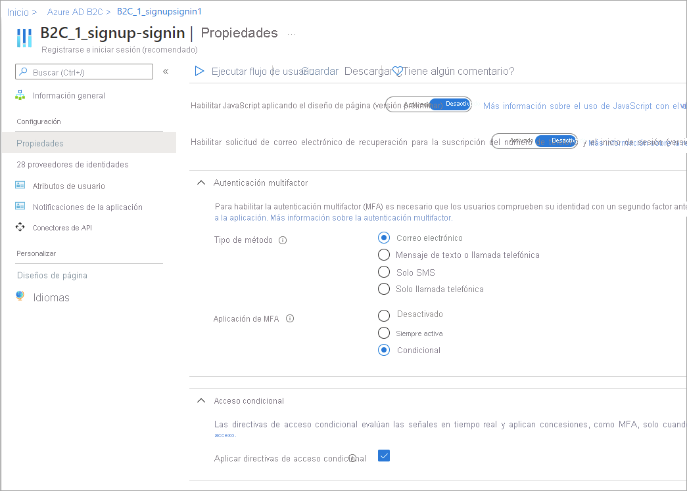

# <a name="add-conditional-access-to-user-flows-in-azure-active-directory-b2c"></a>Adición del acceso condicional a los flujos de usuario en Azure AD B2C
[!INCLUDE [active-directory-b2c-choose-user-flow-or-custom-policy](../../includes/active-directory-b2c-choose-user-flow-or-custom-policy.md)]
Se puede agregar el acceso condicional a los flujos de usuario y directivas personalizadas de Azure Active Directory B2C (Azure AD B2C) para administrar los inicios de sesión de riesgo en las aplicaciones. El acceso condicional de Azure Active Directory (Azure AD) es la herramienta que usa Azure AD B2C para reunir las señales, tomar decisiones y aplicar las directivas de la organización.
 La automatización de la evaluación de riesgos con condiciones de directivas significa que se identifican inmediatamente los inicios de sesión de riesgo y, a continuación, se corrigen o bloquean.
## <a name="service-overview"></a>Introducción al servicio
Azure AD B2C evalúa todos los eventos de inicio de sesión y garantiza que se cumplan todos los requisitos de las directivas antes de conceder acceso al usuario. Durante esta fase de **evaluación**, el servicio de acceso condicional evalúa las señales recopiladas por las detecciones de riesgo de Identity Protection durante los eventos de inicio de sesión. El resultado de este proceso de evaluación es un conjunto de notificaciones que indica si se debe conceder o bloquear el inicio de sesión. La directiva de Azure AD B2C utiliza estas notificaciones para actuar dentro del flujo de usuario. Un ejemplo es bloquear el acceso o desafiar al usuario con una corrección específica como la autenticación multifactor (MFA). "Bloquear acceso" reemplaza el resto de configuraciones.
::: zone pivot="b2c-custom-policy"
En el ejemplo siguiente se muestra un perfil técnico de acceso condicional que se usa para evaluar la amenaza de inicio de sesión.
```XML
<TechnicalProfile Id="ConditionalAccessEvaluation">
  <DisplayName>Conditional Access Provider</DisplayName>
  <Protocol Name="Proprietary" Handler="Web.TPEngine.Providers.ConditionalAccessProtocolProvider, Web.TPEngine, Version=1.0.0.0, Culture=neutral, PublicKeyToken=null" />
  <Metadata>
    <Item Key="OperationType">Evaluation</Item>
  </Metadata>
  ...
</TechnicalProfile>
```
Para asegurarse de que las señales de Identity Protection se evalúan correctamente, querrá llamar al `ConditionalAccessEvaluation`perfil técnico de todos los usuarios, incluidas las cuentas [locales y sociales](technical-overview.md#consumer-accounts). De lo contrario, Identity Protection indicará un grado de riesgo incorrecto asociado a los usuarios.
::: zone-end
En la fase de *corrección* que se muestra a continuación, se dirige al usuario a un desafío de MFA. Una vez completado, Azure AD B2C informa a Identity Protection de que se ha corregido la amenaza de inicio de sesión identificada y el método utilizado. En este ejemplo, Azure AD B2C indica que el usuario ha completado correctamente el desafío de la autenticación multifactor.
La corrección también puede producirse a través de otros canales. Por ejemplo, cuando el administrador o el usuario restablecen la contraseña de la cuenta. Puede comprobar el *estado de riesgo* del usuario en el [informe de usuarios de riesgo](identity-protection-investigate-risk.md#navigating-the-risky-users-report).
::: zone pivot="b2c-custom-policy"
> [!IMPORTANT]
> Para corregir el riesgo dentro del recorrido correctamente, asegúrese de que se llama al perfil técnico de *corrección* después de ejecutar el perfil técnico de *evaluación*. Si la *evaluación* se invoca sin *corrección*, el estado de riesgo estará *En riesgo*.
Cuando la recomendación del perfil técnico de *evaluación* devuelve `Block`, no se requiere la llamada al perfil técnico de *evaluación*. El estado de riesgo se establece en *En riesgo*.
En el ejemplo siguiente se muestra un perfil técnico de acceso condicional que se usa para corregir la amenaza identificada:
```XML
<TechnicalProfile Id="ConditionalAccessRemediation">
  <DisplayName>Conditional Access Remediation</DisplayName>
  <Protocol Name="Proprietary" Handler="Web.TPEngine.Providers.ConditionalAccessProtocolProvider, Web.TPEngine, Version=1.0.0.0, Culture=neutral, PublicKeyToken=null"/>
  <Metadata>
    <Item Key="OperationType">Remediation</Item>
  </Metadata>
  ...
</TechnicalProfile>
```
::: zone-end
## <a name="components-of-the-solution"></a>Componentes de la solución
Estos son los componentes que habilitan el acceso condicional en Azure AD B2C:
- **Flujo de usuario** o **directiva personalizada** que guían al usuario en el proceso de inicio de sesión y registro.
- **Directiva de acceso condicional** que reúne las señales para tomar decisiones y aplicar las directivas de la organización. Cuando un usuario inicia sesión en la aplicación mediante una directiva de Azure AD B2C, la directiva de acceso condicional usa las señales de Azure AD Identity Protection para identificar inicios de sesión de riesgo y presenta la acción correctiva adecuada.
- **Aplicación registrada** que dirige a los usuarios al flujo de usuario o a la directiva personalizada de Azure AD B2C adecuados.
- [Explorador Tor](https://www.torproject.org/download/) para simular un inicio de sesión de riesgo.
## <a name="service-limitations-and-considerations"></a>Limitaciones y consideraciones del servicio
Al utilizar el acceso condicional de Azure AD, tenga en cuenta lo siguiente:
- Identity Protection está disponible para identidades tanto locales como sociales, como Google o Facebook. En el caso de las identidades sociales, debe activar manualmente el acceso condicional. La detección es limitada porque el proveedor de identidades externo administra las credenciales de la cuenta social.
- En los inquilinos de Azure AD B2C, solo hay disponible un subconjunto de directivas de [acceso condicional de Azure AD](../active-directory/conditional-access/overview.md).

## <a name="prerequisites"></a>Prerrequisitos

[!INCLUDE [active-directory-b2c-customization-prerequisites-custom-policy](../../includes/active-directory-b2c-customization-prerequisites-custom-policy.md)]
## <a name="pricing-tier"></a>Plan de tarifa
Se requiere Azure AD B2C **Premium P2** para crear directivas de inicio de sesión de riesgo. Los inquilinos **Premium P1** pueden crear una directiva basada en la ubicación, la aplicación, el usuario o directivas basadas en grupos. Para más información, consulte [Cambio del plan de tarifa de Azure AD](billing.md#change-your-azure-ad-pricing-tier).
## <a name="prepare-your-azure-ad-b2c-tenant"></a>Preparación del inquilino de Azure AD B2C
Para agregar una directiva de acceso condicional, deshabilite los valores predeterminados de seguridad:
1. Inicie sesión en [Azure Portal](https://portal.azure.com/).
2. Seleccione el icono **Directorio y suscripción** en la barra de herramientas del portal y, luego, elija el directorio que contiene el inquilino de Azure AD B2C.
3. En **Servicios de Azure**, seleccione **Azure AD B2C**. O bien, use el cuadro de búsqueda para buscar y seleccionar **Azure AD B2C**.
4. Seleccione **Propiedades** y, a continuación, seleccione **Administrar valores predeterminados de seguridad**.
   
5. En **Habilitar los valores predeterminados de seguridad**, seleccione **No**.
   

## <a name="add-a-conditional-access-policy"></a>Adición de una directiva de acceso condicional

Una directiva de acceso condicional es una instrucción if-then de asignaciones y controles de acceso. Una directiva de acceso condicional reúne las señales para tomar decisiones y aplicar las directivas de la organización. 

> [!TIP]
> En este paso, va a configurar la directiva de acceso condicional. Se recomienda usar una de las siguientes plantillas: [Plantilla 1: acceso condicional basado en el riesgo de inicio de sesión](#template-1-sign-in-risk-based-conditional-access), [Plantilla 2: acceso condicional basado en el riesgo del usuario](#template-2-user-risk-based-conditional-access) o [Plantilla 3: bloqueo de ubicaciones con acceso condicional](#template-3-block-locations-with-conditional-access). Puede configurar la directiva de acceso condicional mediante Azure Portal o MS Graph API.

El operador lógico entre las asignaciones es *y*. El operador en cada asignación es *o*.

 Para agregar una directiva de acceso condicional:
1. En Azure Portal, busque y seleccione **Azure AD B2C**.
1. En **Seguridad**, seleccione **Acceso condicional**. Se abre la página **Directivas de acceso condicional**.
1. Seleccione **+ Nueva directiva**.
1. Escriba un nombre para la directiva, como *Bloquear inicio de sesión de riesgo*.
1. En **Asignaciones**, elija **Usuarios y grupos** y, a continuación, seleccione una de las siguientes configuraciones admitidas:

| Incluir  |Licencia   |   Notas|
|---|---|---|
|**Todos los usuarios**    | P1, P2  | Si decide incluir **Todos los usuarios**, esta directiva afectará a todos los usuarios. Para asegurarse de no bloquearse, excluya su cuenta administrativa; para ello, seleccione **Excluir**, seleccione **Roles del directorio** y, a continuación, seleccione **Administrador global** en la lista. También puede seleccionar **Usuarios y grupos** y, a continuación, seleccionar su cuenta en la lista **Seleccionar usuarios excluidos**.  |

1. Seleccione **Aplicaciones en la nube o acciones** y, a continuación, **Seleccionar aplicaciones**. Busque la [aplicación de usuario de confianza](tutorial-register-applications.md).
1. Seleccione **Condiciones** y, a continuación, seleccione entre las siguientes condiciones. Por ejemplo, seleccione **Riesgo de inicio de sesión** y los niveles de riesgo **Alto**, **Medio** y **Bajo**.

|Condición|Licencia   |Notas   |
|---|---|---|
| **Riesgo de usuario**  | P2  |Un riesgo de usuario representa la probabilidad de que una identidad o cuenta determinada esté en peligro.   |
| **Riesgo de inicio de sesión**   | P2  |Un riesgo de inicio de sesión representa la probabilidad de que el propietario de la identidad no haya autorizado una solicitud de autenticación determinada.   |
| **Plataformas de dispositivo**  |No compatible   |Se caracteriza por el sistema operativo que se ejecuta en un dispositivo. Para más información, consulte [Plataformas de dispositivo](../active-directory/conditional-access/concept-conditional-access-conditions.md#device-platforms).   |
| **Ubicaciones**  |P1, P2   |Las ubicaciones con nombre pueden incluir la información de red IPv4 pública, el país o la región, o áreas desconocidas que no se asignan a regiones o países específicos. Para obtener más información, vea [Ubicaciones](../active-directory/conditional-access/concept-conditional-access-conditions.md#locations).   |

3. En **Controles de acceso**, seleccione **Conceder**. A continuación, seleccione si desea bloquear o conceder el acceso:

|Opción   | Licencia  | Nota:  |
|---|---|---|
| **Bloquear acceso**  |P1, P2| Impide el acceso en función de las condiciones especificadas en esta directiva de acceso condicional.  |  
| **Conceder acceso** con **Requerir autenticación multifactor**.  | P1, P2| Según las condiciones especificadas en esta directiva de acceso condicional, el usuario debe pasar la autenticación multifactor de Azure AD B2C. |  

4. En **Habilitar directiva**, seleccione una de las siguientes opciones:

| Opción  | Licencia  | Nota:  |
|---|---|---|
|**Solo informe**    | P1, P2  | La opción Solo informe permite a los administradores evaluar el impacto de las directivas de acceso condicional antes de habilitarlas en su entorno. Se recomienda que compruebe la directiva con este estado y determine el impacto para los usuarios finales sin requerir la autenticación multifactor ni bloquear a los usuarios. Para más información, consulte [Revisión de los resultados del acceso condicional en el informe de auditoría](#review-conditional-access-outcomes-in-the-audit-report).  |
|**Activado**   |  P1, P2 |La directiva de acceso se evalúa y no se aplica.   |
|**Desactivado**    | P1, P2  | La directiva de acceso no está activada y no tiene ningún efecto en los usuarios.  |

5. Habilite la directiva de acceso condicional de prueba; para ello, seleccione **Crear**.

## <a name="template-1-sign-in-risk-based-conditional-access"></a>Plantilla 1: acceso condicional basado en el riesgo de inicio de sesión

La mayoría de los usuarios tienen un comportamiento normal que puede seguirse, cuando se salen de esta norma, podría ser peligroso permitirles que simplemente inicien sesión. Es posible que sea conveniente bloquear a ese usuario o quizás simplemente puede pedirle que lleve a cabo la autenticación multifactor para demostrar que realmente es quien dice ser. Un riesgo de inicio de sesión representa la probabilidad de que el propietario de la identidad no haya autorizado una solicitud de autenticación determinada. Los inquilinos de Azure AD B2C con licencias P2 pueden crear directivas de acceso condicional que incorporen detecciones de riesgo de inicio de sesión de Azure AD Identity Protection.

Tenga en cuenta las limitaciones de las detecciones de Identity Protection para B2C. Si se detecta un riesgo, los usuarios pueden realizar el proceso de autenticación multifactor para solucionar automáticamente el evento de inicio de sesión peligroso y cerrarlo para evitar ruidos innecesarios para los administradores.

Configure el acceso condicional a través de las API de Azure Portal o Microsoft Graph para habilitar una directiva de acceso condicional basada en el riesgo de inicio de sesión que requiera MFA cuando el riesgo de inicio de sesión sea medio o alto.

   1. En **Incluir**, seleccione **Todos los usuarios**.
   2. En **Excluir**, seleccione **Usuarios y grupos** y, luego, elija las cuentas de acceso de emergencia de la organización.
   3. Seleccione **Listo**.
6. En **Aplicaciones en la nube o acciones** > **Incluir**, seleccione **Todas las aplicaciones en la nube**.
7. En **Condiciones** > **Riesgo de inicio de sesión**, establezca **Configurar** en **Sí**. En **Seleccionar el nivel de riesgo de inicio de sesión, esta directiva se aplicará a** 
   1. Seleccione **Alto** y **Medio**.
   2. Seleccione **Listo**.
8. En **Controles de acceso** > **Conceder**, seleccione **Conceder acceso**, **Requerir autenticación multifactor** y **Seleccionar**.
9. Confirme la configuración y establezca **Habilitar directiva** en **Activado**.
10. Seleccione **Crear** para crear la directiva.

### <a name="enable-template-1-with-conditional-access-apis-optional"></a>Habilitación de la plantilla 1 con las API de acceso condicional (opcional)

Cree una directiva de acceso condicional basada en el riesgo de inicio de sesión con las API de MS Graph. Para más información, consulte [API de acceso condicional](../active-directory/conditional-access/howto-conditional-access-apis.md#graph-api).
La plantilla siguiente se puede usar para crear una directiva de acceso condicional con el nombre para mostrar "Plantilla 1: Requerir MFA para el riesgo medio o alto de inicio de sesión" en modo de solo informe.
```json
{
    "displayName": "Template 1: Require MFA for medium+ sign-in risk",
    "state": "enabledForReportingButNotEnforced",
    "conditions": {
        "signInRiskLevels": [ "high" ,
            "medium"
        ],
        "applications": {
            "includeApplications": [
                "All"
            ]
        },
        "users": {
            "includeUsers": [
                "All"
            ],
            "excludeUsers": [
                "f753047e-de31-4c74-a6fb-c38589047723"
            ]
        }
    },
    "grantControls": {
        "operator": "OR",
        "builtInControls": [
            "mfa"
        ]
    }
}
```

## <a name="template-2-user-risk-based-conditional-access"></a>Plantilla 2: acceso condicional basado en el riesgo del usuario

Identity Protection puede calcular los niveles normales del comportamiento de un usuario y usarlos para basar las decisiones de su riesgo. El riesgo del usuario es un cálculo de la probabilidad de que se haya puesto en peligro una identidad. Los inquilinos B2C con licencias P2 puede crear directivas de acceso condicional que incorporen el riesgo del usuario. Cuando se detecta un usuario como en riesgo, puede requerirle que cambie de forma segura su contraseña para corregir el riesgo y obtener acceso a su cuenta. Se recomienda configurar una directiva de riesgo de usuario para requerir un cambio de contraseña seguro para que los usuarios puedan realizar la corrección por sí mismos.

Más información sobre el [riesgo de usuario en Identity Protection](../active-directory/identity-protection/concept-identity-protection-risks.md#user-risk), teniendo en cuenta las [limitaciones de las detecciones de Identity Protection para B2C](identity-protection-investigate-risk.md#service-limitations-and-considerations).

Configure el acceso condicional mediante Azure Portal o Microsoft Graph API para habilitar una directiva de acceso condicional basada en el riesgo del usuario que requiera autenticación multifactor (MFA) y cambio de contraseña cuando el riesgo del usuario sea medio o alto.

Para configurar el acceso condicional basado en el usuario:
1. Inicie sesión en **Azure Portal**.
2. Vaya a **Azure AD B2C** > **Seguridad** > **Acceso condicional**.
3. Seleccione **Nueva directiva**.
4. Asigne un nombre a la directiva. Se recomienda que las organizaciones creen un estándar significativo para los nombres de sus directivas.
5. En **Asignaciones**, seleccione **Usuarios y grupos**.
   1. En **Incluir**, seleccione **Todos los usuarios**.
   2. En **Excluir**, seleccione **Usuarios y grupos** y, luego, elija las cuentas de acceso de emergencia de la organización. 
   3. Seleccione **Listo**.
6. En **Aplicaciones en la nube o acciones** > **Incluir**, seleccione **Todas las aplicaciones en la nube**.
7. En **Condiciones** > **Riesgo de usuario**, establezca **Configurar** en **Sí**. En **Configure los niveles de riesgo de usuario necesarios para aplicar la directiva** 
   1. Seleccione **Alto** y **Medio**.
   2. Seleccione **Listo**.
8. En **Controles de acceso** > **Conceder**, seleccione **Conceder acceso**, **Requerir cambio de contraseña** y **Seleccionar**. **Requerir autenticación multifactor** también será necesario de manera predeterminada.
9. Confirme la configuración y establezca **Habilitar directiva** en **Activado**.
10. Seleccione **Crear** para crear la directiva.

### <a name="enable-template-2-with-conditional-access-apis-optional"></a>Habilitación de la plantilla 2 con las API de acceso condicional (opcional)

Para crear una directiva de acceso condicional basada en el riesgo del usuario con las API de acceso condicional, consulte la documentación de las [API de acceso condicional](../active-directory/conditional-access/howto-conditional-access-apis.md#graph-api).

La plantilla siguiente se puede usar para crear una directiva de acceso condicional con el nombre para mostrar "Plantilla 2: Requerir un cambio de contraseña seguro para el riesgo de usuario medio o alto" en modo de solo informe.
```json
{
    "displayName": "Template 2: Require secure password change for medium+ user risk",
    "state": "enabledForReportingButNotEnforced",
    "conditions": {
        "userRiskLevels": [ "high" ,
            "medium"
        ],
        "applications": {
            "includeApplications": [
                "All"
            ]
        },
        "users": {
            "includeUsers": [
                "All"
            ],
            "excludeUsers": [
                "f753047e-de31-4c74-a6fb-c38589047723"
            ]
        }
    },
    "grantControls": {
        "operator": "AND",
        "builtInControls": [
            "mfa",
            "passwordChange"
        ]
    }
}
```

## <a name="template-3-block-locations-with-conditional-access"></a>Plantilla 3: bloqueo de ubicaciones con acceso condicional

Gracias a la condición de ubicación del acceso condicional, podrá controlar el acceso a las aplicaciones en la nube en función de la ubicación de red de un usuario. Puede encontrar más información sobre la condición de ubicación en el acceso condicional en el artículo [Uso de la condición de ubicación en una directiva de acceso condicional](../active-directory/conditional-access/location-condition.md

Configure el acceso condicional mediante Azure Portal o Microsoft Graph API para habilitar una directiva de acceso condicional que bloquee el acceso a ubicaciones específicas.
Puede encontrar más información sobre la condición de ubicación en el acceso condicional en el artículo [Uso de la condición de ubicación en una directiva de acceso condicional](../active-directory/conditional-access/location-condition.md).

### <a name="define-locations"></a>Definición de ubicaciones

1. Inicie sesión en **Azure Portal**.
2. Vaya a **Azure AD B2C** > **Seguridad** > **Acceso condicional** > **Ubicaciones con nombre**.
3. Seleccione **Ubicación de los países** o **Ubicación de los intervalos de direcciones IP**.
4. Asigne un nombre a la ubicación.
5. Proporcione los valores de Intervalos IP o seleccione el valor de Países o regiones de la ubicación especificada. Si elige Países o regiones, puede optar por incluir áreas desconocidas.
6. Elija **Guardar**.
Para habilitar con la directiva de acceso condicional:

1. Inicie sesión en **Azure Portal**.
2. Vaya a **Azure AD B2C** > **Seguridad** > **Acceso condicional**.
3. Seleccione **Nueva directiva**.
4. Asigne un nombre a la directiva. Se recomienda que las organizaciones creen un estándar significativo para los nombres de sus directivas.
5. En **Asignaciones**, seleccione **Usuarios y grupos**.
   1. En **Incluir**, seleccione **Todos los usuarios**.
   2. En **Excluir**, seleccione **Usuarios y grupos** y, luego, elija las cuentas de acceso de emergencia de la organización. 
   3. Seleccione **Listo**.
6. En **Aplicaciones en la nube o acciones** > **Incluir**, seleccione **Todas las aplicaciones en la nube**.
7. En **Condiciones** > **Ubicación**
   1. Establezca **Configurar** en **Sí**.
   2. En **Incluir**, seleccione **Ubicaciones seleccionadas**.
   3. Seleccione la ubicación con nombre que ha creado.
   4. Haga clic en **Seleccionar**
8. En **Controles de acceso** > seleccione **Bloquear acceso** y seleccione **Seleccionar**.
9. Confirme la configuración y establezca **Habilitar directiva** en **Activado**.
10. Seleccione **Crear** para crear la directiva.

### <a name="enable-template-3-with-conditional-access-apis-optional"></a>Habilitación de la plantilla 3 con las API de acceso condicional (opcional)

Para crear una directiva de acceso condicional basada en la ubicación con las API de acceso condicional, consulte la documentación de las [API de acceso condicional](../active-directory/conditional-access/howto-conditional-access-apis.md#graph-api). Para configurar ubicaciones con nombre, consulte las documentación de las [ubicaciones con nombre](/graph/api/resources/namedlocation).

La plantilla siguiente se puede usar para crear una directiva de acceso condicional con el nombre para mostrar "Plantilla 3: bloqueo de ubicaciones no permitidas" en modo de solo informe.
```json
{
    "displayName": "Template 3: Block unallowed locations",
    "state": "enabledForReportingButNotEnforced",
    "conditions": {
        "applications": {
            "includeApplications": [
                "All"
            ]
        },
        "users": {
            "includeUsers": [
                "All"
            ],
            "excludeUsers": [
                "f753047e-de31-4c74-a6fb-c38589047723"
            ]
        },
        "locations": {
            "includeLocations": [
                "b5c47916-b835-4c77-bd91-807ec08bf2a3"
          ]
        }
    },
    "grantControls": {
        "operator": "OR",
        "builtInControls": [
            "block"
        ]
    }
}
```
## <a name="add-conditional-access-to-a-user-flow"></a>Adición del acceso condicional a un flujo de usuario
Después de agregar la directiva de acceso condicional de Azure AD, habilite el acceso condicional en el flujo de usuario o en la directiva personalizada. Al habilitar el acceso condicional, no es necesario especificar un nombre de directiva.
Se pueden aplicar varias directivas de acceso condicional a un usuario individual en cualquier momento. En este caso, la directiva de control de acceso más estricta tiene prioridad. Por ejemplo, si una directiva requiere MFA, mientras que las demás bloquean el acceso, se bloqueará al usuario.
## <a name="enable-multi-factor-authentication-optional"></a>Habilitación de la autenticación multifactor (opcional)
Al agregar acceso condicional a un flujo de usuario, considere la posibilidad de usar la **autenticación multifactor (MFA)** . Los usuarios pueden usar un código de un solo uso mediante SMS o voz, o una contraseña de un solo uso por correo electrónico para la autenticación multifactor. Los valores de MFA se configuran por separado de la configuración del acceso condicional. Puede elegir entre estas opciones de MFA:
- **Desactivado**: MFA nunca se aplica durante el inicio de sesión y no se pide a los usuarios que se inscriban en MFA durante el registro o el inicio de sesión.
- **Siempre activa**: se requiere siempre MFA, independientemente de cualquier configuración de acceso condicional. Durante el registro, se pide a los usuarios que se inscriban en MFA. Durante el inicio de sesión, si los usuarios aún no están inscritos en MFA, se les pedirá que se inscriban.
- **Condicional**: durante el registro y el inicio de sesión, se pide a los usuarios que se inscriban en MFA (tanto los nuevos usuarios como los usuarios existentes que no están inscritos en MFA). Durante el inicio de sesión, MFA solo se aplica cuando una evaluación de directiva de acceso condicional activa lo requiere:
   - Si el resultado es un desafío de MFA sin riesgo, se aplica MFA. Si el usuario aún no está inscrito en MFA, se le pedirá que se inscriba.
   - Si el resultado es un desafío de MFA debido al riesgo *y* el usuario no está inscrito en MFA, el inicio de sesión se bloquea.
   > [!NOTE]
   > Con la disponibilidad general del acceso condicional en Azure AD B2C, ahora se pide a los usuarios que se inscriban en un método MFA durante el registro. Los flujos de usuario de registro que creó antes de la disponibilidad general no reflejarán automáticamente este nuevo comportamiento, pero puede incluirlo mediante la creación de nuevos flujos de usuario.
::: zone pivot="b2c-user-flow"
Para habilitar el acceso condicional para un flujo de usuario, asegúrese de que la versión admite el acceso condicional. Estas versiones de flujo de usuario se etiquetan como **Recomendado**.
1. Inicie sesión en [Azure Portal](https://portal.azure.com).
1. Seleccione el icono **Directorio y suscripción** en la barra de herramientas del portal y, luego, elija el directorio que contiene el inquilino de Azure AD B2C.
1. En **Servicios de Azure**, seleccione **Azure AD B2C**. O bien, use el cuadro de búsqueda para buscar y seleccionar **Azure AD B2C**.
1. En **Directivas**, seleccione **Flujos de usuario**. A continuación, seleccione el flujo de usuario.
1. Seleccione **Propiedades** y asegúrese de que el flujo de usuario admite el acceso condicional; para ello, busque la configuración con la etiqueta **Acceso condicional**.
   
1. En la sección **Autenticación multifactor**, seleccione el **Tipo de método** deseado y, a continuación, en **MFA enforcement** (Aplicación de MFA), seleccione **Condicional**.
1. En la sección **Acceso condicional**, seleccione la casilla **Enforce conditional access policies** (Aplicar directivas de acceso condicional).
1. Seleccione **Guardar**.
::: zone-end
::: zone pivot="b2c-custom-policy"
## <a name="add-conditional-access-to-your-policy"></a>Adición del acceso condicional a una directiva
1. Obtenga un ejemplo de una directiva de acceso condicional en [GitHub](https://github.com/azure-ad-b2c/samples/tree/master/policies/conditional-access).
1. En cada archivo, reemplace la cadena `yourtenant` por el nombre del inquilino de Azure AD B2C. Por ejemplo, si el nombre del inquilino de B2C es *contosob2c*, todas las instancias de `yourtenant.onmicrosoft.com` se convierten en `contosob2c.onmicrosoft.com`.
1. Cargue los archivos de directivas.
### <a name="configure-claim-other-than-phone-number-to-be-used-for-mfa"></a>Configuración de otra notificación que no sea el número de teléfono que se usará como MFA
En la directiva de acceso condicional anterior, el `DoesClaimExist`método de transformación de notificación comprueba si una notificación contiene un valor, por ejemplo, si la notificación `strongAuthenticationPhoneNumber` contiene un número de teléfono. La transformación de notificaciones no se limita a la notificación `strongAuthenticationPhoneNumber`. En función del escenario, puede usar cualquier otra notificación. En el siguiente fragmento XML, la notificación `strongAuthenticationEmailAddress` se comprueba en su lugar. La notificación que elija debe tener un valor válido; de lo contrario, la notificación `IsMfaRegistered` se establecerá en `False`. Cuando se establece en `False`, la evaluación de la directiva de acceso condicional devuelve un tipo de concesión `Block`, lo que impide que el usuario complete el flujo de usuario.
```XML
 <ClaimsTransformation Id="IsMfaRegisteredCT" TransformationMethod="DoesClaimExist">
  <InputClaims>
    <InputClaim ClaimTypeReferenceId="strongAuthenticationEmailAddress" TransformationClaimType="inputClaim" />
  </InputClaims>
  <OutputClaims>
    <OutputClaim ClaimTypeReferenceId="IsMfaRegistered" TransformationClaimType="outputClaim" />
  </OutputClaims>
 </ClaimsTransformation>
```
## <a name="test-your-custom-policy"></a>Prueba de la directiva personalizada
1. Seleccione la directiva `B2C_1A_signup_signin_with_ca` o `B2C_1A_signup_signin_with_ca_whatif` para abrir su página de información general. A continuación, seleccione **Ejecutar flujo de usuario**. En **Aplicación**, seleccione *webapp1*. La **dirección URL de respuesta** debe mostrar `https://jwt.ms`.
1. Copie la dirección URL de **Ejecutar punto de conexión de flujo de usuario**.
1. Para simular un inicio de sesión de riesgo, abra el [explorador Tor](https://www.torproject.org/download/) y use la dirección URL que copió en el paso anterior para iniciar sesión en la aplicación registrada.
1. Escriba la información solicitada en la página de inicio de sesión e intente iniciar sesión. El token se devuelve al `https://jwt.ms` y debe mostrarse. En el token descodificado jwt.ms, debería ver que el inicio de sesión se ha bloqueado.
::: zone-end
::: zone pivot="b2c-user-flow"
## <a name="test-your-user-flow"></a>Prueba del flujo de usuario
1. Seleccione el flujo de usuario que ha creado para abrir su página de información general y, luego, elija **Ejecutar flujo de usuario**. En **Aplicación**, seleccione *webapp1*. La **dirección URL de respuesta** debe mostrar `https://jwt.ms`.
1. Copie la dirección URL de **Ejecutar punto de conexión de flujo de usuario**.
1. Para simular un inicio de sesión de riesgo, abra el [explorador Tor](https://www.torproject.org/download/) y use la dirección URL que copió en el paso anterior para iniciar sesión en la aplicación registrada.
1. Escriba la información solicitada en la página de inicio de sesión e intente iniciar sesión. El token se devuelve al `https://jwt.ms` y debe mostrarse. En el token descodificado jwt.ms, debería ver que el inicio de sesión se ha bloqueado.
::: zone-end
## <a name="review-conditional-access-outcomes-in-the-audit-report"></a>Revisión de los resultados del acceso condicional en el informe de auditoría
Para revisar el resultado de un evento de acceso condicional:
1. Inicie sesión en [Azure Portal](https://portal.azure.com/).
2. Seleccione el icono **Directorio y suscripción** en la barra de herramientas del portal y, luego, elija el directorio que contiene el inquilino de Azure AD B2C.
3. En **Servicios de Azure**, seleccione **Azure AD B2C**. O bien, use el cuadro de búsqueda para buscar y seleccionar **Azure AD B2C**.
4. En **Actividades**, seleccione **Registros de auditoría**.
5. Filtre el registro de auditoría; para ello, establezca **Categoría** en **B2C** y establezca **Tipo de recurso de actividad** en **IdentityProtection**. Luego, seleccione **Aplicar**.
6. Revise la actividad de auditoría de los últimos siete días. Se incluyen los siguientes tipos de actividad:
   - **Evaluar directivas de acceso condicional**: esta entrada del registro de auditoría indica que se ha realizado una evaluación de acceso condicional durante una autenticación.
   - **Corregir usuario**: esta entrada indica que el usuario final cumplió la concesión o los requisitos de una directiva de acceso condicional y que esta actividad se comunicó al motor de riesgo para mitigar (reducir el riesgo) al usuario.
7. Seleccione una entrada de registro de tipo **Evaluar directivas de acceso condicional** en la lista para abrir la página **Detalles de la actividad: registro de auditoría**, que muestra los identificadores del registro de auditoría, junto con esta información, en la sección **Detalles adicionales**:
   - **ConditionalAccessResult**: concesión requerida por la evaluación de la directiva condicional.
   - **AppliedPolicies**: lista de todas las directivas de acceso condicional en las que se cumplieron las condiciones y las directivas están activadas.
   - **ReportingPolicies**: lista de las directivas de acceso condicional que se establecieron en modo de solo informe y en las que se cumplieron las condiciones.
   
## <a name="next-steps"></a>Pasos siguientes

[Personalización de la interfaz de usuario en un flujo de usuario de Azure AD B2C](customize-ui-with-html.md)


