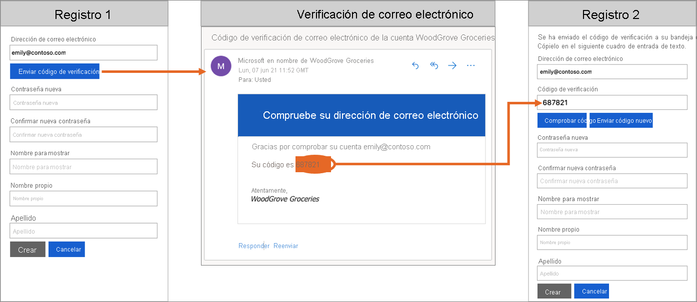
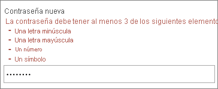

# Introducción a los aspectos técnicos y las características de Azure Active Directory B2C

Como complemento al artículo [Acerca de Azure Active Directory B2C](overview.md), en este artículo se proporciona una introducción en profundidad al servicio. Aquí se tratan los principales recursos con los que se trabaja en el servicio, sus características. Conozca estos características le permiten proporcionar una experiencia de identidad totalmente personalizada a los clientes en sus aplicaciones.

## Inquilino de Azure AD B2C

En Azure Active Directory B2C (Azure AD B2C), un *inquilino* representa la organización y es un directorio de usuarios. Cada inquilino de Azure AD B2C es distinto e independiente del resto de inquilinos de Azure AD B2C. Un inquilino de Azure AD B2C es diferente de un inquilino de Azure Active Directory, que es posible que ya tenga.

Los recursos principales con los que trabaja en un inquilino de Azure AD B2C son:

* **Directorio**: el *directorio* es donde Azure AD B2C almacena las credenciales del usuario, los datos del perfil y los registros de aplicaciones.
* **Registros de aplicación**: se registran las aplicaciones web, móviles y nativas en Azure AD B2C para permitir la administración de identidades. También se registran las API que quiera proteger con Azure AD B2C.
* **Flujos de usuario** y **directivas personalizadas**: las experiencias de identidad integradas (flujos de usuario) y completamente personalizables (directivas personalizadas) de sus aplicaciones.
  * Use *flujos de usuario* para la configuración rápida y la habilitación de tareas comunes de identidad como registro, inicio de sesión y edición de perfiles.
  * Use *directivas personalizadas* para flujos de trabajo complejos únicos para la organización, los clientes, los empleados, los asociados y los ciudadanos.
* **Proveedores de identidades**: configuración de federación para:
  * Proveedores de identidades de *redes sociales*, como Facebook, LinkedIn o Twitter que quiera admitir en sus aplicaciones.
  * Proveedores de identidades *externos* que admiten protocolos de identidad estándar, como OAuth 2.0, OpenID Connect, etc.
  * Cuentas *locales* que permiten a los usuarios registrarse e iniciar sesión con un nombre de usuario (o una dirección de correo electrónico u otro identificador) y una contraseña.
* **Claves**: agregue y administre claves de cifrado para la firma y la validación de los tokens, secretos de cliente, certificados y contraseñas.

El primer recurso que debe crear para empezar a trabajar con este servicio es un inquilino de Azure AD B2C. Obtenga información sobre cómo:

* [Crear un inquilino de Azure Active Directory B2C](tutorial-create-tenant.md).
* [Administrar el inquilino de Azure AD B2C](tenant-management.md)

## Cuentas en Azure AD B2C

Azure AD B2C define varios tipos de cuentas de usuario. Azure Active Directory, Azure Active Directory B2B y Azure Active Directory B2C comparten estos tipos de cuentas.

* **Cuenta profesional**: los usuarios con una cuenta profesional pueden administrar los recursos de un inquilino y, si además tienen un rol de administrador, también pueden administrar inquilinos. Asimismo, estos usuarios pueden crear cuentas de consumidor, restablecer contraseñas, bloquear o desbloquear cuentas y establecer permisos o asignar una cuenta a un grupo de seguridad.
* **Cuenta de invitado**: usuarios externos a los que invita en su inquilino. Un escenario típico para invitar a un usuario invitado al inquilino de Azure AD B2C es compartir las responsabilidades de administración.
* **Cuenta de consumidor**: cuentas administradas por flujos de usuario y directivas personalizadas de Azure AD B2C.

 *Ilustración: Directorio de usuario dentro de un inquilino de Azure AD B2C en Azure Portal*

### Cuentas de consumidor

Con una cuenta de *consumidor*, los usuarios pueden iniciar sesión en las aplicaciones que ha protegido con Azure AD B2C. Sin embargo, no pueden acceder a los recursos de Azure, por ejemplo, a Azure Portal.

Una cuenta de consumidor se puede asociar con estos tipos de identidad:

* Identidad **local**, con el nombre de usuario y la contraseña almacenados localmente en el directorio de Azure AD B2C. A menudo se hace referencia a estas identidades como "cuentas locales".
* Las identidades de **redes sociales** o de **empresa**, en las que la identidad del usuario se administra mediante un proveedor de identidades federado. Por ejemplo, Facebook, Microsoft, ADFS o Salesforce.

Un usuario con una cuenta de consumidor puede iniciar sesión con varias identidades. Por ejemplo, el nombre de usuario, el correo electrónico, el identificador de empleado, el identificador oficial y otras. Una sola cuenta puede tener varias identidades, tanto locales como de redes sociales.

 *Ilustración: Una sola cuenta de consumidor con varias identidades en Azure AD B2C*

Para más información, consulte [Introducción a las cuentas de usuario en Azure Active Directory B2C](user-overview.md).

## Opciones de inicio de sesión en la cuenta local

Azure AD B2C proporciona varias maneras en las que los usuarios pueden autenticar a un usuario. Los usuarios pueden iniciar sesión en una cuenta local con el nombre de usuario y la contraseña, la comprobación por teléfono (también conocida como autenticación sin contraseña). El registro de correo electrónico se habilita de forma predeterminada en la configuración del proveedor de identidades de la cuenta local.

Para obtener más información, vea [Configuración del proveedor de identidades de la cuenta local](identity-provider-local.md).

## Atributos de perfil de usuario

Azure AD B2C permite administrar los atributos comunes de los perfiles de cuentas de consumidor. Por ejemplo, nombre para mostrar, apellido, nombre propio, ciudad y otros.

También se puede ampliar el esquema de Azure AD para almacenar información adicional sobre los usuarios. Por ejemplo, su país o región de residencia, el idioma preferido y las preferencias, por ejemplo, si quieren suscribirse a un boletín o habilitar la autenticación multifactor. Para más información, consulte:

* [Atributos de perfil de usuario](user-profile-attributes.md)
* [Adición de atributos de usuario y personalización de entradas de usuario en Azure Active Directory B2C](configure-user-input.md)

## Inicio de sesión con proveedores de identidades externos

Puede configurar Azure AD B2C para permitir que los usuarios inicien sesión en su aplicación con las credenciales de proveedores de identidades de redes sociales o de empresa. Azure AD B2C puede federarse con proveedores de identidades que admitan los protocolos OAuth 1.0, OAuth 2.0, OpenID Connect y SAML. Por ejemplo, Facebook, cuenta Microsoft, Google, Twitter y AD FS.

Con la federación de proveedores de identidades externos, puede ofrecer a sus consumidores la posibilidad de iniciar sesión con sus cuentas de redes sociales o de empresa existentes, sin tener que crear una cuenta solo para la aplicación.

En la página de registro o inicio de sesión, Azure AD B2C presenta una lista de proveedores de identidades externos que el usuario puede elegir para iniciar sesión. Después de seleccionar uno de los proveedores de identidades externos, se le redirige al sitio web del proveedor seleccionado para completar el proceso de inicio de sesión. Una vez que el usuario inicia sesión correctamente, se le devuelve a Azure AD B2C para autenticar la cuenta en la aplicación.

Para ver cómo se agregan proveedores de identidades en Azure AD B2C, consulte [Incorporación de proveedores de identidades a las aplicaciones en Azure Active Directory B2C](add-identity-provider.md).

## Experiencias de identidad: flujos de usuario o directivas personalizadas

En Azure AD B2C, puede definir la lógica de negocios que siguen los usuarios para obtener acceso a su aplicación. Por ejemplo, puede determinar la secuencia de pasos que siguen los usuarios cuando inician sesión, se registran, editan un perfil o restablecen una contraseña. Después de completar la secuencia, el usuario adquiere un token y obtiene acceso a la aplicación.

En Azure AD B2C, hay dos formas de ofrecer experiencias de usuario relacionadas con la identidad:

* Los **flujos de usuario** son directivas configurables, predefinidas e integradas que se proporcionan para que pueda crear experiencias de registro, inicio de sesión y edición de directivas en cuestión de minutos.

* Las **directivas personalizadas** le permiten crear sus propios recorridos de usuario para escenarios complejos de experiencia de identidad.

En la siguiente captura de pantalla se muestra la interfaz de configuración de flujos de usuario con relación a archivos de configuración de directivas personalizadas.

Lea el artículo [Información general sobre los flujos de usuario y las directivas personalizadas](user-flow-overview.md). Proporciona una breve descripción general de los flujos de usuario y las directivas personalizadas, con el fin de ayudarle a decidir el método que mejor se adecúa a sus necesidades empresariales.

## Interfaz de usuario

En Azure AD B2C, puede crear las experiencias de identidad de sus usuarios para que las páginas que se muestran se combinen sin problemas con la apariencia de su marca. Casi se consigue el control completo del contenido HTML y CSS que se presenta a los usuarios cuando prosiguen su recorrido de identidad de la aplicación. Gracias a esta flexibilidad, también puede mantener la coherencia visual y de la marca entre la aplicación y Azure AD B2C.

Para información sobre la personalización de la IU, consulte:

* [Personalizar la interfaz del usuario](customize-ui.md)
* [Personalización de la interfaz de usuario con plantillas HTML](customize-ui-with-html.md)
* [Habilitación de JavaScript y selección de una versión de diseño de página](javascript-and-page-layout.md)

## Dominio personalizado

Puede personalizar el dominio de Azure AD B2C en las direcciones URL de redireccionamiento para Azure AD B2C. El dominio personalizado permite crear una experiencia sin problemas para que las páginas que se muestran se combinen a la perfección con el nombre de dominio de la aplicación.

Desde la perspectiva del usuario, permanecen en el dominio durante el proceso de inicio de sesión, en lugar de redirigirse al dominio predeterminado de Azure AD B2C .b2clogin.com. Para obtener más información, vea [Habilitación de dominios personalizados](custom-domain.md).
 
## Localización

La personalización del idioma en Azure AD B2C permite albergar distintos idiomas a fin de satisfacer las necesidades de los clientes. Microsoft proporciona las traducciones de 36 idiomas, pero el usuario también puede proporcionar sus propias traducciones en cualquier idioma. Incluso si su experiencia se proporciona únicamente para un idioma, puede personalizar cualquier texto de las páginas.

Vea cómo funciona la localización en [Personalización de idioma en Azure Active Directory B2C](language-customization.md).

## Comprobación de correo electrónico

Azure AD B2C garantiza direcciones de correo electrónico válidas exigiendo que los consumidores puedan comprobarlas durante el proceso de suscripción, y flujos de restablecimiento de contraseña. También evita que actores malintencionados usen procesos automatizados para generar cuentas fraudulentas en las aplicaciones.

Puede personalizar el correo electrónico a los usuarios que registre para usar sus aplicaciones. Mediante el proveedor de correo electrónico de terceros, puede usar su propia plantilla de correo electrónico, dirección De: y asunto, además de admitir la localización y la configuración personalizada de la contraseña de un solo uso (OTP). Para más información, consulte:

* [Verificación de correo electrónico personalizado con Mailjet](custom-email-mailjet.md)
* [Verificación de correo electrónico personalizado con SendGrid](custom-email-sendgrid.md)

## Agregar su propia lógica de negocios

Si decide usar directivas personalizadas, puede integrarlas con una API de RESTful en un recorrido de usuario para agregar su propia lógica de negocios al recorrido. Por ejemplo, Azure AD B2C puede intercambiar datos con un servicio RESTful con los siguientes fines:

* Mostrar mensajes de error intuitivos personalizados.
* Validar los datos proporcionados por el usuario para evitar que aquellos con un formato incorrecto permanezcan en el directorio de usuario. Por ejemplo, puede modificar los datos especificados por el usuario, como poner en mayúscula la primera letra del nombre si se escribe en minúscula.
* Enriquecer los datos de usuario mediante la integración adicional con la aplicación de línea de negocio corporativa.
* Con las llamadas de RESTful, puede enviar notificaciones push, actualizar las bases de datos corporativas, ejecutar un proceso de migración de usuarios, administrar permisos, auditar bases de datos y mucho más.

Los programas de fidelidad son otro escenario que posibilita la compatibilidad de Azure AD B2C con las llamadas a las API REST. Por ejemplo, el servicio RESTful puede recibir la dirección de correo electrónico del usuario, consultar la base de datos de clientes y devolver el número de fidelidad del usuario a Azure AD B2C. 

Los datos devueltos se pueden almacenar en la cuenta del directorio del usuario en Azure AD B2C. Los datos se pueden evaluar más adelante en los siguientes pasos de la directiva o se pueden incluir en el token de acceso.

Puede agregar una llamada a la API REST en cualquier paso del recorrido del usuario definido por una directiva personalizada. Por ejemplo, puede llamar a una API REST:

* Durante el inicio de sesión, justo antes de que Azure AD B2C valide las credenciales
* Inmediatamente después del inicio de sesión
* Antes de que Azure AD B2C cree una cuenta en el directorio
* Después de que Azure AD B2C cree una cuenta en el directorio
* Antes de que Azure AD B2C emita un token de acceso

Para ver cómo se usan las directivas personalizadas para la integración de la API RESTful en Azure AD B2C, consulte [Integración de intercambios de notificaciones de API REST en la directiva personalizada de Azure AD B2C](api-connectors-overview.md).

## Protocolos y tokens

- Para las aplicaciones, Azure AD B2C admite los protocolos [OAuth 2.0](protocols-overview.md), [OpenID Connect](openid-connect.md) y [SAML](saml-service-provider.md) para los recorridos del usuario. Su aplicación inicia este recorrido del usuario mediante la emisión de solicitudes de autenticación a Azure AD B2C. El resultado de una solicitud a Azure AD B2C es un token de seguridad como, por ejemplo, un [token de identificador, un token de acceso](tokens-overview.md) o un token de SAML. Este token de seguridad define la identidad del usuario en la aplicación.

- En el caso de identidades externas, Azure AD B2C admite la federación con los proveedores de identidades de OAuth 1.0, OAuth 2.0, OpenID Connect y SAML.

En el diagrama siguiente se muestra cómo se puede comunicar Azure AD B2C mediante varios protocolos dentro del mismo flujo de autenticación:

1. La aplicación de usuario de confianza inicia una solicitud de autorización a Azure AD B2C mediante OpenID Connect.
1. Cuando un usuario de la aplicación elige iniciar sesión con un proveedor de identidades externo que usa el protocolo SAML, Azure AD B2C invoca el protocolo SAML para comunicarse con el proveedor de identidades.
1. Una vez que el usuario completa la operación de inicio de sesión con el proveedor de identidades externo, Azure AD B2C devuelve el token a la aplicación de usuario de confianza mediante OpenID Connect.

## Integración de aplicaciones

Cuando un usuario quiere iniciar sesión en su aplicación, esta inicia una solicitud de autorización a un punto de conexión proporcionado por un flujo de usuario o una directiva personalizada. El flujo de usuario o la directiva personalizada definen y controlan la experiencia del usuario. Al completar un flujo de usuario, por ejemplo, el flujo de *registro o inicio de sesión*, Azure AD B2C genera un token y, luego, redirige al usuario de vuelta a la aplicación.

Varias aplicaciones pueden usar el mismo flujo de usuario o directiva personalizada. Una sola aplicación puede usar varios flujos de usuario o directivas personalizadas.

Por ejemplo, para iniciar sesión en una aplicación, la aplicación usa el flujo de usuario de *registro o inicio de sesión*. Cuando el usuario ha iniciado sesión, puede querer editar su perfil, así que la aplicación inicia otra solicitud de autorización, esta vez mediante el flujo de usuario de *edición del perfil*.

## Multi-Factor Authentication (MFA)

La autenticación multifactor (MFA) de Azure AD B2C ayuda a proteger el acceso a los datos y las aplicaciones, al tiempo que mantiene la simplicidad para los usuarios. Ofrece seguridad adicional al exigir una segunda forma de autenticación y proporciona autenticación segura con una oferta de métodos de autenticación fáciles de usar. 

Puede que a los usuarios no se les muestre el desafío de MFA, ya que depende de las decisiones de configuración que pueda tomar como administrador.

Consulte cómo se habilita MFA en los flujos de usuario en [Habilitación de la autenticación multifactor en Azure Active Directory B2C](multi-factor-authentication.md).

## Acceso condicional

Las características de detección de riesgos de Azure AD Identity Protection, incluidos los usuarios de riesgo y los inicios de sesión de riesgo, se detectan y se muestran automáticamente en el inquilino de Azure AD B2C. Puede crear directivas de acceso condicional que utilicen estas detecciones de riesgos para determinar las acciones de corrección y aplicar las directivas de la organización. 

Azure AD B2C evalúa todos los eventos de inicio de sesión y garantiza que se cumplan todos los requisitos de las directivas antes de conceder acceso al usuario. Los usuarios o inicios de sesión arriesgados pueden bloquearse, o se les puede presentar un desafío con un remedio específico como la autenticación multifactor (MFA). Para obtener más información, vea [Identity Protection y acceso condicional](conditional-access-identity-protection-overview.md).

## Complejidad de la contraseña

Durante el registro o el restablecimiento de la contraseña, los usuarios deben proporcionar una contraseña que cumpla las reglas de complejidad. De forma predeterminada, Azure AD B2C aplica una directiva de contraseñas seguras. Azure AD B2C también proporciona opciones de configuración para especificar los requisitos de complejidad de las contraseñas que usan los clientes.

Para obtener más información, vea [Configuración de los requisitos de complejidad de las contraseñas en Azure AD B2C](password-complexity.md).

## Forzar el restablecimiento de contraseñas

Como administrador de inquilinos de Azure AD B2C, puede [restablecer la contraseña de un usuario](manage-users-portal.md#reset-a-users-password) si este no la recuerda. También puede forzar al usuario a que restablezca la contraseña periódicamente. Para obtener más información, consulte [Configuración de un flujo de restablecimiento de contraseña forzado](force-password-reset.md).

## Bloqueo inteligente de la cuenta

Con el fin de evitar intentos de adivinación de contraseñas por fuerza bruta, Azure AD B2C usa una estrategia sofisticada para bloquear las cuentas en función de la dirección IP de la solicitud, las contraseñas especificadas y otros diversos factores. La duración del bloqueo aumenta automáticamente en función del riesgo y el número de intentos.

Para obtener más información sobre cómo administrar la configuración de protección con contraseña, vea [Mitigación de ataques con credenciales en Azure AD B2C](threat-management.md).

## Protección de recursos e identidades de cliente

Azure AD B2C cumple los compromisos de seguridad, privacidad y demás descritos en el [Centro de confianza de Microsoft Azure](https://www.microsoft.com/trustcenter/cloudservices/azure).

Las sesiones se modelan como datos cifrados, donde solo el servicio de token de seguridad de Azure AD B2C conoce la clave de cifrado. Se usa un algoritmo de cifrado seguro, AES-192. Todas las rutas de comunicación están protegidas con TLS para ofrecer confidencialidad e integridad. Nuestro servicio de token de seguridad emplea un certificado de validación extendida (EV) para TLS. En general, el servicio de token de seguridad mitiga los ataques de scripts de sitios (XSS) al no representar las entradas que no son de confianza.

### Acceso a los datos de usuario

Los inquilinos de Azure AD B2C comparten muchas características con los inquilinos de Azure Active Directory empresarial que se usan con empleados y asociados. Los aspectos compartidos incluyen mecanismos para ver roles administrativos, asignar roles y auditar actividades.

Puede asignar roles para controlar quién puede realizar determinadas acciones administrativas en Azure AD B2C, por ejemplo:

* Crear y administrar todos los aspectos de los flujos de usuario
* Crear y administrar el esquema de atributos disponible para todos los flujos de usuario
* Configurar proveedores de identidades para su uso en la federación directa
* Crear y administrar directivas del marco de confianza en Identity Experience Framework (directivas personalizadas)
* Administrar los secretos en la federación y el cifrado en Identity Experience Framework (directivas personalizadas)

Para más información sobre los roles de Azure AD, incluida la compatibilidad con los roles de administración de Azure AD B2C, consulte [Permisos de roles de administrador en Azure Active Directory](../active-directory/roles/permissions-reference.md).

## Auditoría y registros

Azure AD B2C emite registros de auditoría que contienen información de actividad sobre sus recursos, los tokens emitidos y el acceso de administrador. Puede usar los registros de auditoría para comprender la actividad de la plataforma y diagnosticar problemas. Las entradas del registro de auditoría están disponibles poco después de que se produzca la actividad que generó el evento.

En un registro de auditoría, que está disponible para el inquilino de Azure AD B2C o para un usuario determinado, puede encontrar información como esta:

* Actividades relacionadas con la autorización de un usuario para acceder a los recursos de B2C (por ejemplo, un administrador que accede a una lista de directivas de B2C)
* Actividades relacionadas con los atributos de directorio que se recuperan cuando un administrador inicia sesión con Azure Portal
* Operaciones de creación, lectura, actualización y eliminación (CRUD) en aplicaciones B2C
* Operaciones CRUD en claves almacenadas en un contenedor de claves B2C
* Operaciones CRUD en recursos de B2C (por ejemplo, directivas y proveedores de identidades)
* Validación de credenciales de usuario y emisión de tokens

Para más información sobre los registros de auditoría, consulte [Acceso a los registros de auditoría de Azure AD B2C](view-audit-logs.md).

## Análisis de uso

Azure AD B2C permite detectar cuándo los usuarios se registran o inician sesión en la aplicación, dónde se encuentran los usuarios y qué exploradores y sistemas operativos usan. 

Al integrar Azure Application Insights en las directivas personalizadas de Azure AD B2C, puede sacar conclusiones sobre cómo cada usuario se registra, inicia sesión, restablece su contraseña o edita su perfil. Con este conocimiento, puede tomar decisiones basadas en los datos de cara a los próximos ciclos de desarrollo.

Para más información, consulte [Seguimiento del comportamiento del usuario en Azure Active Directory B2C mediante Application Insights](analytics-with-application-insights.md).

## Pasos siguientes

Ahora que tiene una visión más profunda de las características y los aspectos técnicos de Azure Active Directory B2C, empiece con nuestro [tutorial para crear un inquilino de Azure Active Directory B2C](tutorial-create-tenant.md).
