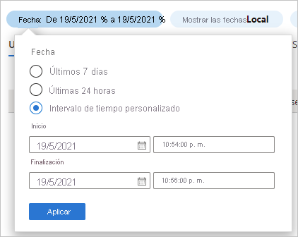
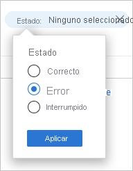

# Inicio rápido: Análisis de los inicios de sesión con el registro de inicios de sesión de Azure AD 

Con la información del registro de inicios de sesión de Azure AD puede averiguar qué ha ocurrido si se produjo un error en el inicio de sesión de un usuario. En este inicio rápido se muestra cómo encontrar el inicio de sesión con error mediante el registro de inicios de sesión.

## Requisitos previos

Para completar el escenario en este inicio rápido, necesita:

- **Acceso a un inquilino de Azure AD**: si no tiene acceso a uno, consulte [Cree su cuenta gratuita de Azure hoy mismo](https://azure.microsoft.com/free/?WT.mc_id=A261C142F). 
- **Una cuenta de prueba denominada Isabella Simonsen**: si no sabe cómo crear una cuenta de prueba, consulte [Agregar usuarios basados en la nube](../fundamentals/add-users-azure-active-directory.md#add-a-new-user).

## Creación de un inicio de sesión con errores

El objetivo de este paso es crear un registro de un inicio de sesión con error en el registro de inicios de sesión de Azure AD.

**Para este paso:**

1. Inicie sesión en [Azure Portal](https://portal.azure.com/) como Isabella Simonsen con una contraseña incorrecta.

2. Espere 5 minutos para asegurarse de que la entrada aparece en el registro de inicios de sesión. Para más información, consulte [Informes de actividad](reference-reports-latencies.md#activity-reports).

## Identificación del inicio de sesión con errores

En esta sección se proporcionan los pasos para analizar un inicio de sesión con errores:

- **Filtrado de los inicios de sesión**: quite todos los registros que no sean pertinentes para el análisis. Por ejemplo, establezca un filtro para mostrar solo los registros de un usuario específico.
- **Búsqueda de información adicional sobre el error**: además de la información que puede encontrar en el registro de inicios de sesión, también puede buscar el error mediante la [herramienta de búsqueda de errores de inicio de sesión](https://login.microsoftonline.com/error). Esta herramienta puede proporcionarle información adicional sobre un error de inicio de sesión. 

**Para revisar el inicio de sesión con errores:**

1. Vaya al [registro de inicios de sesión](https://portal.azure.com/#blade/Microsoft_AAD_IAM/ActiveDirectoryMenuBlade/SignIns).

2. Para mostrar solo los registros de Isabella Simonsen:

    a. En la barra de herramientas, haga clic en **Agregar filtros**.
    
       

    b. En la lista **Elija un campo**, seleccione **Usuario** y, a continuación, haga clic **en Aplicar**.

    c. En el cuadro de texto **Nombre de usuario**, escriba **Isabella Simonsen** y haga clic en **Aplicar**.

    d. En la barra de herramientas, haga clic en **Actualizar**.

3. Para analizar el problema, haga clic en **Solución de problemas y soporte técnico**.

       

4. Copie el **código de error de inicio de sesión**.

       

5. Pegue el código de error en el cuadro de texto de la [herramienta de búsqueda de errores de inicio de sesión](https://login.microsoftonline.com/error) y haga clic en **Enviar**.

Revise el resultado de la herramienta y determine si proporciona información adicional.

## Pruebas adicionales

Ahora que sabe cómo buscar una entrada en el registro de inicios de sesión por nombre, también debe intentar buscar el registro mediante los filtros siguientes:

- **Fecha**: intente buscar el usuario Isabella mediante **Inicio** y **Fin**.

    

- **Estado**: intente encontrar el usuario Isabella mediante **Estado: Error**.

    

## Limpieza de recursos

Cuando ya no lo necesite, elimine el usuario de prueba. Si no sabe cómo eliminar un usuario de Azure AD, consulte [Eliminación de usuarios desde Azure AD](../fundamentals/add-users-azure-active-directory.md#delete-a-user).

## Pasos siguientes

> [!div class="nextstepaction"]
> [¿Qué son los informes de Azure Active Directory?](overview-reports.md)
