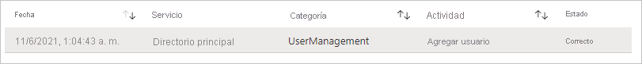
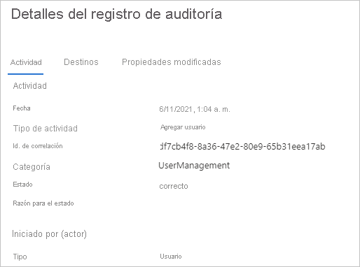

# Inicio rápido: Filtrado del registro de auditoría de Azure AD 

Con la información de los registros de auditoría de Azure AD, obtiene acceso a registros de actividades del sistema de cumplimiento. En este inicio rápido se muestra cómo encontrar una cuenta de usuario recién creada en el registro de auditoría.

## Requisitos previos

Para completar el escenario en este inicio rápido, necesita:

- **Acceso a un inquilino de Azure AD**: si no tiene acceso a uno, consulte [Cree su cuenta de Azure gratuita hoy mismo](https://azure.microsoft.com/free/?WT.mc_id=A261C142F). 
- **Una cuenta de prueba denominada Isabella Simonsen**: si no sabe cómo crear una cuenta de prueba, consulte [Agregar usuarios basados en la nube](../fundamentals/add-users-azure-active-directory.md#add-a-new-user).

## Búsqueda de la nueva cuenta de usuario

En esta sección se proporcionan los pasos para filtrar el registro de auditoría.

**Para buscar el nuevo usuario:**

1. Vaya al [registro de auditoría](https://portal.azure.com/#blade/Microsoft_AAD_IAM/ActiveDirectoryMenuBlade/Audit).

2. Para mostrar solo los registros de Isabella Simonsen:

    a. En la barra de herramientas, haga clic en **Agregar filtros**.
    
       

    b. En la lista **Elija un campo**, seleccione **Destino** y, luego, haga clic en **Aplicar**.

    c. En el cuadro de texto **Destino**, en **Nombre principal de usuario**, escriba **Isabella Simonsen** y, luego, haga clic en **Aplicar**.

3. Haga clic en el elemento filtrado.

      

4.  Revise los **detalles del registro de auditoría**.
 
      
 
  

## Limpieza de recursos

Cuando ya no lo necesite, elimine el usuario de prueba. Si no sabe cómo eliminar un usuario de Azure AD, consulte [Eliminación de usuarios desde Azure AD](../fundamentals/add-users-azure-active-directory.md#delete-a-user).

## Pasos siguientes

> [!div class="nextstepaction"]
> [¿Qué son los informes de Azure Active Directory?](overview-reports.md)
