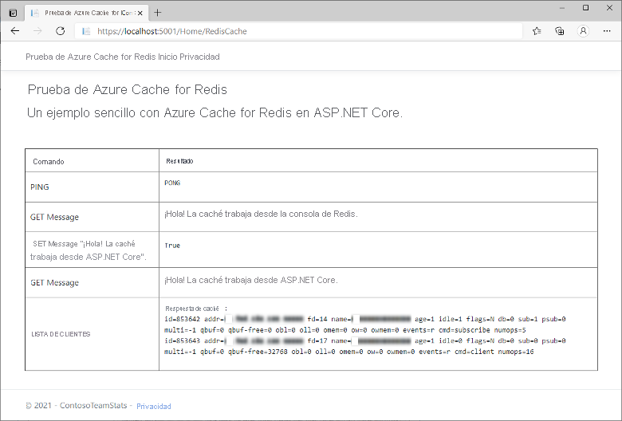

# <a name="quickstart-use-azure-cache-for-redis-with-an-aspnet-core-web-app"></a>Inicio rápido: Uso de Azure Cache for Redis con una aplicación web de ASP.NET Core 

En este inicio rápido incorporará Azure Cache for Redis en una aplicación web de ASP.NET Core que se conecte a él para almacenar datos en la caché y recuperarlos.

## <a name="skip-to-the-code-on-github"></a>Ir al código en GitHub

Si quiere pasar directamente al código, consulte el [inicio rápido de ASP.NET Core](https://github.com/Azure-Samples/azure-cache-redis-samples/tree/main/quickstart/aspnet-core) en GitHub.

## <a name="prerequisites"></a>Requisitos previos

- Una suscripción a Azure: [cree una cuenta gratuita](https://azure.microsoft.com/free/)
- [SDK de .NET Core](https://dotnet.microsoft.com/download)

## <a name="create-a-cache"></a>Creación de una caché

[!INCLUDE [redis-cache-create](../../includes/redis-cache-create.md)]

[!INCLUDE [redis-cache-access-keys](../../includes/redis-cache-access-keys.md)]

Tome nota del **NOMBRE DE HOST** y de la **clave de acceso** principal. Usará estos valores más adelante para construir el secreto *CacheConnection*.

## <a name="create-an-aspnet-core-web-app"></a>Crear una aplicación web de ASP.NET Core

Abra una nueva ventana de comandos y ejecute el siguiente comando para crear una aplicación web de ASP.NET Core (Modelo-Vista-Controlador):

```dotnetcli
dotnet new mvc -o ContosoTeamStats
```

En la ventana de comandos, cambie al nuevo directorio del proyecto *ContosoTeamStats*.

[!INCLUDE[Add Secret Manager support to an ASP.NET Core project](../../includes/azure-app-configuration-add-secret-manager.md)]

Ejecute el siguiente comando para agregar el paquete *Microsoft.Extensions.Configuration.UserSecrets* al proyecto:

```dotnetcli
dotnet add package Microsoft.Extensions.Configuration.UserSecrets
```

Ejecute el siguiente comando para restaurar los paquetes:

```dotnetcli
dotnet restore
```

En la ventana Comandos, ejecute el siguiente comando para almacenar un secreto nuevo denominado *CacheConnection* después de reemplazar los marcadores de posición (incluidos los corchetes angulares) por el nombre de la caché y la clave de acceso principal:

```dotnetcli
dotnet user-secrets set CacheConnection "<cache name>.redis.cache.windows.net,abortConnect=false,ssl=true,allowAdmin=true,password=<primary-access-key>"
```

## <a name="configure-the-cache-client"></a>Configuración del cliente de caché

En esta sección configurará la aplicación para utilizar el cliente [StackExchange.Redis](https://github.com/StackExchange/StackExchange.Redis) para .NET.

En la ventana de comandos, ejecute el siguiente comando en el directorio del proyecto *ContosoTeamStats*:

```dotnetcli
dotnet add package StackExchange.Redis
```

Una vez completada la instalación, el cliente de caché *StackExchange.Redis* está disponible para su uso con el proyecto.

## <a name="update-the-homecontroller-and-layout"></a>Actualización de HomeController y Layout

Agregue las siguientes instrucciones `using` a *Controllers\HomeController.cs*:

```csharp
using System.Net.Sockets;
using System.Text;
using System.Threading;

using Microsoft.Extensions.Configuration;

using StackExchange.Redis;
```

Sustituya:

```csharp
private readonly ILogger<HomeController> _logger;

public HomeController(ILogger<HomeController> logger)
{
    _logger = logger;
}
```

Por:

```csharp
private readonly ILogger<HomeController> _logger;
private static IConfiguration Configuration { get; set; }

public HomeController(ILogger<HomeController> logger, IConfiguration configuration)
{
    _logger = logger;
    if (Configuration == null)
        Configuration = configuration;
}
```

Agregue los siguientes miembros a la clase `HomeController` para admitir una nueva acción `RedisCache` que ejecuta algunos comandos en la nueva caché.

```csharp
public ActionResult RedisCache()
{
    ViewBag.Message = "A simple example with Azure Cache for Redis on ASP.NET Core.";

    IDatabase cache = GetDatabase();

    // Perform cache operations using the cache object...

    // Simple PING command
    ViewBag.command1 = "PING";
    ViewBag.command1Result = cache.Execute(ViewBag.command1).ToString();

    // Simple get and put of integral data types into the cache
    ViewBag.command2 = "GET Message";
    ViewBag.command2Result = cache.StringGet("Message").ToString();

    ViewBag.command3 = "SET Message \"Hello! The cache is working from ASP.NET Core!\"";
    ViewBag.command3Result = cache.StringSet("Message", "Hello! The cache is working from ASP.NET Core!").ToString();

    // Demonstrate "SET Message" executed as expected...
    ViewBag.command4 = "GET Message";
    ViewBag.command4Result = cache.StringGet("Message").ToString();

    // Get the client list, useful to see if connection list is growing...
    // Note that this requires allowAdmin=true in the connection string
    ViewBag.command5 = "CLIENT LIST";
    StringBuilder sb = new StringBuilder();
    var endpoint = (System.Net.DnsEndPoint)GetEndPoints()[0];
    IServer server = GetServer(endpoint.Host, endpoint.Port);
    ClientInfo[] clients = server.ClientList();

    sb.AppendLine("Cache response :");
    foreach (ClientInfo client in clients)
    {
        sb.AppendLine(client.Raw);
    }

    ViewBag.command5Result = sb.ToString();

    return View();
}

private const string SecretName = "CacheConnection";

private static long lastReconnectTicks = DateTimeOffset.MinValue.UtcTicks;
private static DateTimeOffset firstErrorTime = DateTimeOffset.MinValue;
private static DateTimeOffset previousErrorTime = DateTimeOffset.MinValue;

private static readonly object reconnectLock = new object();

// In general, let StackExchange.Redis handle most reconnects,
// so limit the frequency of how often ForceReconnect() will
// actually reconnect.
public static TimeSpan ReconnectMinFrequency => TimeSpan.FromSeconds(60);

// If errors continue for longer than the below threshold, then the
// multiplexer seems to not be reconnecting, so ForceReconnect() will
// re-create the multiplexer.
public static TimeSpan ReconnectErrorThreshold => TimeSpan.FromSeconds(30);

public static int RetryMaxAttempts => 5;

private static Lazy<ConnectionMultiplexer> lazyConnection = CreateConnection();

public static ConnectionMultiplexer Connection
{
    get
    {
        return lazyConnection.Value;
    }
}

private static Lazy<ConnectionMultiplexer> CreateConnection()
{
    return new Lazy<ConnectionMultiplexer>(() =>
    {
        string cacheConnection = Configuration[SecretName];
        return ConnectionMultiplexer.Connect(cacheConnection);
    });
}

private static void CloseConnection(Lazy<ConnectionMultiplexer> oldConnection)
{
    if (oldConnection == null)
        return;

    try
    {
        oldConnection.Value.Close();
    }
    catch (Exception)
    {
        // Example error condition: if accessing oldConnection.Value causes a connection attempt and that fails.
    }
}

/// <summary>
/// Force a new ConnectionMultiplexer to be created.
/// NOTES:
///     1. Users of the ConnectionMultiplexer MUST handle ObjectDisposedExceptions, which can now happen as a result of calling ForceReconnect().
///     2. Don't call ForceReconnect for Timeouts, just for RedisConnectionExceptions or SocketExceptions.
///     3. Call this method every time you see a connection exception. The code will:
///         a. wait to reconnect for at least the "ReconnectErrorThreshold" time of repeated errors before actually reconnecting
///         b. not reconnect more frequently than configured in "ReconnectMinFrequency"
/// </summary>
public static void ForceReconnect()
{
    var utcNow = DateTimeOffset.UtcNow;
    long previousTicks = Interlocked.Read(ref lastReconnectTicks);
    var previousReconnectTime = new DateTimeOffset(previousTicks, TimeSpan.Zero);
    TimeSpan elapsedSinceLastReconnect = utcNow - previousReconnectTime;

    // If multiple threads call ForceReconnect at the same time, we only want to honor one of them.
    if (elapsedSinceLastReconnect < ReconnectMinFrequency)
        return;

    lock (reconnectLock)
    {
        utcNow = DateTimeOffset.UtcNow;
        elapsedSinceLastReconnect = utcNow - previousReconnectTime;

        if (firstErrorTime == DateTimeOffset.MinValue)
        {
            // We haven't seen an error since last reconnect, so set initial values.
            firstErrorTime = utcNow;
            previousErrorTime = utcNow;
            return;
        }

        if (elapsedSinceLastReconnect < ReconnectMinFrequency)
            return; // Some other thread made it through the check and the lock, so nothing to do.

        TimeSpan elapsedSinceFirstError = utcNow - firstErrorTime;
        TimeSpan elapsedSinceMostRecentError = utcNow - previousErrorTime;

        bool shouldReconnect =
            elapsedSinceFirstError >= ReconnectErrorThreshold // Make sure we gave the multiplexer enough time to reconnect on its own if it could.
            && elapsedSinceMostRecentError <= ReconnectErrorThreshold; // Make sure we aren't working on stale data (e.g. if there was a gap in errors, don't reconnect yet).

        // Update the previousErrorTime timestamp to be now (e.g. this reconnect request).
        previousErrorTime = utcNow;

        if (!shouldReconnect)
            return;

        firstErrorTime = DateTimeOffset.MinValue;
        previousErrorTime = DateTimeOffset.MinValue;

        Lazy<ConnectionMultiplexer> oldConnection = lazyConnection;
        CloseConnection(oldConnection);
        lazyConnection = CreateConnection();
        Interlocked.Exchange(ref lastReconnectTicks, utcNow.UtcTicks);
    }
}

// In real applications, consider using a framework such as
// Polly to make it easier to customize the retry approach.
private static T BasicRetry<T>(Func<T> func)
{
    int reconnectRetry = 0;
    int disposedRetry = 0;

    while (true)
    {
        try
        {
            return func();
        }
        catch (Exception ex) when (ex is RedisConnectionException || ex is SocketException)
        {
            reconnectRetry++;
            if (reconnectRetry > RetryMaxAttempts)
                throw;
            ForceReconnect();
        }
        catch (ObjectDisposedException)
        {
            disposedRetry++;
            if (disposedRetry > RetryMaxAttempts)
                throw;
        }
    }
}

public static IDatabase GetDatabase()
{
    return BasicRetry(() => Connection.GetDatabase());
}

public static System.Net.EndPoint[] GetEndPoints()
{
    return BasicRetry(() => Connection.GetEndPoints());
}

public static IServer GetServer(string host, int port)
{
    return BasicRetry(() => Connection.GetServer(host, port));
}
```

Abra *Views\Shared\\_Layout.cshtml*.

Sustituya:

```cshtml
<a class="navbar-brand" asp-area="" asp-controller="Home" asp-action="Index">ContosoTeamStats</a>
```

Por:

```cshtml
<a class="navbar-brand" asp-area="" asp-controller="Home" asp-action="RedisCache">Azure Cache for Redis Test</a>
```

## <a name="add-a-new-rediscache-view-and-update-the-styles"></a>Incorporación de una nueva vista de RedisCache y actualización de los estilos

Creeun archivo *Views\Home\RedisCache.cshtml* con el contenido siguiente:

```cshtml
@{
    ViewBag.Title = "Azure Cache for Redis Test";
}

<h2>@ViewBag.Title.</h2>
<h3>@ViewBag.Message</h3>
<br /><br />
<table border="1" cellpadding="10" class="redis-results">
    <tr>
        <th>Command</th>
        <th>Result</th>
    </tr>
    <tr>
        <td>@ViewBag.command1</td>
        <td><pre>@ViewBag.command1Result</pre></td>
    </tr>
    <tr>
        <td>@ViewBag.command2</td>
        <td><pre>@ViewBag.command2Result</pre></td>
    </tr>
    <tr>
        <td>@ViewBag.command3</td>
        <td><pre>@ViewBag.command3Result</pre></td>
    </tr>
    <tr>
        <td>@ViewBag.command4</td>
        <td><pre>@ViewBag.command4Result</pre></td>
    </tr>
    <tr>
        <td>@ViewBag.command5</td>
        <td><pre>@ViewBag.command5Result</pre></td>
    </tr>
</table>
```

Agregue las líneas siguientes a *wwwroot\css\site.css*:

```css
.redis-results pre {
  white-space: pre-wrap;
}
```

## <a name="run-the-app-locally"></a>Probar la aplicación localmente

Ejecute el siguiente comando en la ventana Comandos para compilar la aplicación:

```dotnetcli
dotnet build
```

Luego, ejecute la aplicación con el siguiente comando:

```dotnetcli
dotnet run
```

Vaya a `https://localhost:5001` en el explorador web.

Seleccione **Azure Redis Cache Test** (Prueba de Azure Redis Cache) en la barra de navegación de la página web para probar el acceso a la memoria caché.

En el ejemplo siguiente, puede ver que la clave `Message` tenía anteriormente un valor almacenado en caché, que se estableció mediante la Consola de Redis en Azure Portal. La aplicación actualizó ese valor almacenado en caché. La aplicación también ejecutó los comandos `PING` y `CLIENT LIST`.



## <a name="clean-up-resources"></a>Limpieza de recursos

Si va a seguir con el tutorial siguiente, puede mantener los recursos creados en esta guía de inicio rápido y volverlos a utilizar.

En caso contrario, si ya ha terminado con la aplicación de ejemplo de la guía de inicio rápido, puede eliminar los recursos de Azure creados en este tutorial para evitar cargos.

> [!IMPORTANT]
> La eliminación de un grupo de recursos es irreversible. Cuando elimine un grupo de recursos, todos los recursos contenidos en él se eliminan permanentemente. Asegúrese de no eliminar por accidente el grupo de recursos o los recursos equivocados. Si ha creado los recursos para hospedar este ejemplo en un grupo de recursos existente que contiene recursos que quiere conservar, puede eliminar cada recurso individualmente en la parte izquierda, en lugar de eliminar el grupo de recursos.

### <a name="to-delete-a-resource-group"></a>Para eliminar un grupo de recursos

1. Inicie sesión en [Azure Portal](https://portal.azure.com) y después seleccione **Grupos de recursos**.

2. En el cuadro de texto **Filtrar por nombre...**, escriba el nombre del grupo de recursos. En las instrucciones de este artículo se usa un grupo de recursos llamado *TestResources*. En el grupo de recursos, en la lista de resultados, seleccione **...** y, después, **Eliminar grupo de recursos**.

    

Se le pedirá que confirme la eliminación del grupo de recursos. Escriba el nombre del grupo de recursos para confirmar y, después, seleccione **Eliminar**.

Transcurridos unos instantes, el grupo de recursos y todos sus recursos se eliminan.

## <a name="next-steps"></a>Pasos siguientes

Para información sobre cómo implementar en Azure, consulte:

> [!div class="nextstepaction"]
> [Tutorial: Compilación de una aplicación ASP.NET Core y SQL Database en Azure App Service](../app-service/tutorial-dotnetcore-sqldb-app.md)

Para información sobre cómo almacenar el secreto de conexión a la caché en Azure Key Vault, consulte:

> [!div class="nextstepaction"]
> [Proveedor de configuración de Azure Key Vault en ASP.NET Core](/aspnet/core/security/key-vault-configuration)

¿Desea escalar la memoria caché a un nivel superior?

> [!div class="nextstepaction"]
> [Escalado de Azure Cache for Redis](./cache-how-to-scale.md)

¿Quiere optimizar y ahorrar en el gasto en la nube?

> [!div class="nextstepaction"]
> [Comience a analizar los costos con Cost Management](../cost-management-billing/costs/quick-acm-cost-analysis.md?WT.mc_id=costmanagementcontent_docsacmhorizontal_-inproduct-learn)