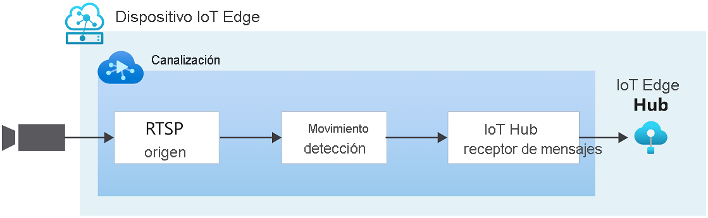

# Inicio rápido: Detección de movimiento y emisión de eventos

Este inicio rápido le guiará por los pasos necesarios para empezar a usar Azure Video Analyzer. Usa una máquina virtual de Azure como un dispositivo IoT Edge y una secuencia de vídeo en directo simulada. Después de completar los pasos de la configuración, podrá ejecutar una secuencia de vídeo en directo simulada mediante una canalización de vídeo que detecta e informa de todos los movimientos de esa secuencia. El siguiente diagrama muestra una representación gráfica de esa canalización.

> [!div class="mx-imgBorder"]
> :::image type="content" source="./media/get-started-detect-motion-emit-events/motion-detection.svg" alt-text="Detección de movimiento":::

::: zone pivot="programming-language-csharp"
[!INCLUDE [header](includes/detect-motion-emit-events-quickstart/csharp/header.md)]
::: zone-end

::: zone pivot="programming-language-python"
[!INCLUDE [header](includes/detect-motion-emit-events-quickstart/python/header.md)]
::: zone-end

## Requisitos previos

::: zone pivot="programming-language-csharp"
[!INCLUDE [prerequisites](./includes/common-includes/csharp-prerequisites.md)]
::: zone-end

::: zone pivot="programming-language-python"
[!INCLUDE [prerequisites](./includes/common-includes/python-prerequisites.md)]
::: zone-end

## Configuración de los recursos de Azure

[!INCLUDE [resources](./includes/common-includes/azure-resources.md)]

## Información general

En este diagrama se muestra cómo fluyen las señales en este inicio rápido. Un [módulo perimetral](https://github.com/Azure/video-analyzer/tree/main/edge-modules/sources/rtspsim-live555) simula una cámara IP que hospeda un servidor de protocolo RTSP. Un nodo de [origen RTSP](pipeline.md#rtsp-source) extrae la fuente de vídeo de este servidor y envía fotogramas de vídeo al nodo del [procesador de detección del movimiento](pipeline.md#motion-detection-processor). El nodo del procesador de detección de movimiento permite detectar movimiento en vídeos en directo. Examina los fotogramas de vídeo entrantes y determina si hay movimiento en el vídeo. Si se detecta movimiento, pasa el fotograma de vídeo al siguiente nodo en la canalización y emite un evento. Por último, los eventos emitidos se envían al receptor de mensajes de IoT Hub donde se publican en IoT Hub.

## Configurado su entorno de desarrollo

::: zone pivot="programming-language-csharp"
[!INCLUDE [setup development environment](./includes/set-up-dev-environment/csharp/csharp-set-up-dev-env.md)]
::: zone-end

::: zone pivot="programming-language-python"
[!INCLUDE [setup development environment](./includes/set-up-dev-environment/python/python-set-up-dev-env.md)]
::: zone-end

## Revisión del vídeo de ejemplo

::: zone pivot="programming-language-csharp"
[!INCLUDE [review-sample-video](./includes/detect-motion-emit-events-quickstart/csharp/review-sample-video.md)]
::: zone-end

::: zone pivot="programming-language-python"
[!INCLUDE [review-sample-video](./includes/detect-motion-emit-events-quickstart/python/review-sample-video.md)]
::: zone-end

## Examen de los archivos de ejemplo

::: zone pivot="programming-language-csharp"
[!INCLUDE [examine-sample-files](./includes/detect-motion-emit-events-quickstart/csharp/examine-sample-files.md)]
::: zone-end

::: zone pivot="programming-language-python"
[!INCLUDE [examine-sample-files](./includes/detect-motion-emit-events-quickstart/python/examine-sample-files.md)]
::: zone-end

## Generación e implementación del manifiesto de implementación

::: zone pivot="programming-language-csharp"
[!INCLUDE [generate-deploy-deployment-manifest](./includes/detect-motion-emit-events-quickstart/csharp/generate-deploy-deployment-manifest.md)]
::: zone-end

::: zone pivot="programming-language-python"
[!INCLUDE [generate-deploy-deployment-manifest](./includes/detect-motion-emit-events-quickstart/python/generate-deploy-deployment-manifest.md)]
::: zone-end

## Preparación para supervisar eventos

::: zone pivot="programming-language-csharp"
[!INCLUDE [prepare-monitor-events](./includes/detect-motion-emit-events-quickstart/csharp/prepare-monitor-events.md)]
::: zone-end

::: zone pivot="programming-language-python"
[!INCLUDE [prepare-monitor-events](./includes/detect-motion-emit-events-quickstart/python/prepare-monitor-events.md)]
::: zone-end

## Ejecución del programa de ejemplo

::: zone pivot="programming-language-csharp"
[!INCLUDE [run-sample-program](./includes/detect-motion-emit-events-quickstart/csharp/run-sample-program.md)]
::: zone-end

::: zone pivot="programming-language-python"
[!INCLUDE [run-sample-program](./includes/detect-motion-emit-events-quickstart/python/run-sample-program.md)]
::: zone-end

## Interpretación de los resultados

::: zone pivot="programming-language-csharp"
[!INCLUDE [interpret-results](includes/detect-motion-emit-events-quickstart/csharp/interpret-results.md)]
::: zone-end

::: zone pivot="programming-language-python"
[!INCLUDE [interpret-results](includes/detect-motion-emit-events-quickstart/python/interpret-results.md)]
::: zone-end

## Limpieza de recursos

Si su intención es probar los demás inicios rápidos, debería conservar los recursos creados. En caso contrario, en Azure Portal, vaya a los grupos de recursos, seleccione el grupo de recursos en el que ejecutó este inicio rápido y, a continuación, elimine todos los recursos.

## Pasos siguientes

- Siga las indicaciones del inicio rápido [Análisis de vídeo en directo con su propio modelo](analyze-live-video-use-your-model-http.md) para aplicar la inteligencia artificial a las fuentes de vídeo en directo.
- Revise los desafíos adicionales para los usuarios avanzados:

  - Use una [cámara IP](https://en.wikipedia.org/wiki/IP_camera) compatible con RTSP en lugar de utilizar el simulador RTSP. Puede encontrar cámaras IP compatibles con RTSP en la página de [productos compatibles con ONVIF](https://www.onvif.org/conformant-products/). Busque dispositivos que cumplan con los perfiles G, S o T.
  - Use un dispositivo Linux AMD64 o x64 en lugar de usar una máquina virtual Linux en Azure. El dispositivo debe estar en la misma red que la cámara IP. Siga las instrucciones de [Instalación del entorno de ejecución de Azure IoT Edge en Linux](/azure/iot-edge/how-to-install-iot-edge?view=iotedge-2020-11&preserve-view=true). A continuación, siga las instrucciones que se encuentran en [Implementación del primer módulo IoT Edge en un dispositivo virtual Linux](/azure/iot-edge/quickstart-linux?view=iotedge-2020-11&preserve-view=true) para registrar el dispositivo con Azure IoT Hub.
