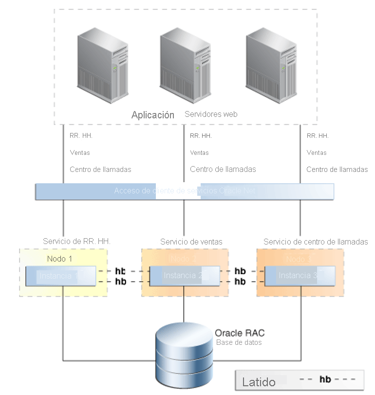

# Características de alta disponibilidad para Oracle en Azure sin sistema operativo

En este artículo, se abordan las principales características de alta disponibilidad y recuperación ante desastres de Oracle.

Oracle ofrece muchas características para crear una plataforma resistente que ejecute bases de datos de Oracle. Aunque ninguna característica única abarca todos los tipos de error, la combinación de tecnologías por niveles da lugar a un sistema de alta disponibilidad. No todas las características son necesarias para ofrecer disponibilidad. Pero la combinación de estrategias ofrece la mejor protección ante la variedad de errores que se producen. 

## Flashback Database

La característica [Flashback Database](https://docs.oracle.com/en/database/oracle/oracle-database/21/rcmrf/FLASHBACK-DATABASE.html#GUID-584AC79A-40C5-45CA-8C63-DED3BE3A4511) está incluida en Oracle Database Enterprise Edition. Flashback Database hace retroceder la base de datos a un momento temporal específico. Esta característica difiere de la restauración a un momento dado de [Recovery Manager (RMAN)](https://docs.oracle.com/en/cloud/paas/db-backup-cloud/csdbb/performing-general-restore-and-recovery-operations.html) en que retrocede a partir del momento actual, en lugar de avanzar después de una restauración. Como consecuencia, Flashback Database acelera el tiempo de finalización.
 
Puede usar esta característica junto con [Oracle Data Guard](https://docs.oracle.com/en/database/oracle/oracle-database/19/sbydb/preface.html#GUID-B6209E95-9DA8-4D37-9BAD-3F000C7E3590). Flashback Database permite al administrador de bases de datos recrear una instancia de una base de datos con errores en una configuración de Data Guard, sin necesidad de llevar a cabo una operación de restauración y recuperación completa de RMAN. Esta característica permite restaurar mucho más rápido la funcionalidad de recuperación ante desastres, así como las ventajas de copia de seguridad y descarga de informes con Active Data Guard.
 
Puede usar la característica en lugar de rehacer base de datos en espera de forma retardada. Una base de datos en espera puede volver a un punto anterior al momento en que se produjo el problema.
 
Oracle Database mantiene registros de flashback en el área de recuperación rápida (FRA). Estos registros son independientes de los registros de rehacer y requieren más espacio en FRA. De forma predeterminada, se conservan los registros de flashback correspondientes a 24 horas, pero puede cambiar esta configuración de acuerdo con sus necesidades.

## Oracle Real Application Clusters

[Oracle Real Application Clusters (RAC)](https://docs.oracle.com/en/database/oracle/oracle-database/19/racad/introduction-to-oracle-rac.html#GUID-5A1B02A2-A327-42DD-A1AD-20610B2A9D92) permite que varios servidores interconectados aparezcan como un servicio de base de datos para los usuarios finales y las aplicaciones. Esta característica elimina muchos puntos de error y es una reconocida solución activa/activa de alta disponibilidad para las bases de datos de Oracle.

Como muestra la ilustración siguiente del artículo que describe [la alta disponibilidad y los procedimientos recomendados de Oracle](https://docs.oracle.com/en/database/oracle/oracle-database/19/haovw/ha-features.html), se presenta una única base de datos RAC al nivel de aplicación. Las aplicaciones se conectan al cliente de escucha de SCAN, que dirige el tráfico a una instancia específica de base de datos. RAC controla el acceso desde varias instancias para garantizar la coherencia de los datos en nodos de proceso independientes.

Si una instancia genera error, el servicio seguirá funcionando en las demás instancias. Cada base de datos implementada en la solución tendrá una configuración de RAC de n+1, donde "n" representa la capacidad mínima de procesamiento necesaria para utilizar el servicio.

Los servicios de Oracle Database se usan para facilitar la conmutación por error de las conexiones entre nodos cuando una instancia genera un error claramente. Esos errores podrían estar planeados o no. Al trabajar con la aplicación (eventos de notificación de aplicación rápidos), cuando una instancia no está disponible, el servicio se traslada a un nodo superviviente. El servicio se traslada a un nodo especificado en la configuración como preferente o disponible.

Otra característica clave de los servicios de Oracle Database consiste en iniciar únicamente un servicio en función de su rol. Esta característica se usa cuando se produce una conmutación por error de Data Guard. Todos los patrones implementados mediante Data Guard son necesarios para vincular un servicio de base de datos a un rol de Data Guard.

Por ejemplo, se podrían crear dos servicios, MY\_DB\_APP y MY\_DB\_AS. El servicio MY\_DB\_APP solo se iniciará cuando la instancia de base de datos se inicie con el rol PRIMARY de Data Guard. MY\_DB\_AS solo se iniciará cuando el rol de Data Guard sea PHYSICAL\_STANDBY. Esta configuración permite a las aplicaciones apuntar al servicio \_APP, al mismo que se generan informes, que se puede descargar en modo de espera o activo y apuntar al servicio \_AS.

## Protección de datos de Oracle

Mediante Data Guard, puede conservar una copia idéntica de una base de datos en una solución de hardware físico independiente. Lo ideal es que la solución de hardware se elimine geográficamente de la base de datos principal. Data Guard no establece límites con respecto a la distancia, aunque esta influye en los modos de protección. Una mayor distancia agrega latencia entre sitios, lo que puede hacer que algunas opciones, como la replicación sincrónica, dejen de ser viables.

Data Guard ofrece ventajas con respecto a la replicación de nivel de almacenamiento:

- Como la replicación es compatible con las bases de datos, solo se replica el tráfico pertinente.
- Algunas cargas de trabajo pueden generar un número elevado de operaciones de entrada y salida en espacios de tablas temporales, que no son necesarios en el modo de espera y, por tanto, no se replican.
- La validación de los bloques replicados se produce en la base de datos en espera, por lo que los daños que afectan a la base de datos principal no se replicarán en la base de datos en espera.
- Se evitan daños lógicos dentro de los bloques y daños asociados a la pérdida de operaciones de escritura. También desparece el riesgo de que los administradores de almacenamiento comentan errores de replicación en la base de datos en espera.
La fase de rehacer se puede aplazar por un tiempo establecido previamente, por lo que los errores del usuario no se replicarán inmediatamente en la base de datos en espera.

## Instantáneas de Azure NetApp Files

La solución de almacenamiento NetApp Files utilizada sin sistema operativo permite crear instantáneas de volúmenes. Las instantáneas permiten revertir rápidamente un sistema de archivos a un momento temporal específico. Las tecnologías de instantáneas permiten objetivos de tiempo de recuperación (RTO) que requieren una fracción del tiempo necesario para restaurar una copia de seguridad de una base de datos.

La funcionalidad de instantáneas para las bases de datos de Oracle está disponible a través de Azure NetApp SnapCenter. SnapCenter facilita las instantáneas con fines de copia de seguridad, SnapVault habilita el almacenamiento sin conexión y Snap Clone ofrece el autoservicio de restauración y otras operaciones. Para más información, consulte [La integración de SnapCenter para Oracle en BareMetal Infrastructure](netapp-snapcenter-integration-oracle-baremetal.md).

## Recovery Manager

Recovery Manager (RMAN) es la utilidad preferente para hacer copias de seguridad de bases de datos físicas. RMAN interactúa con el archivo de control de base de datos (o con un catálogo de recuperación centralizado) para proteger los componentes principales de la base de datos, como los siguientes:

- Archivos de datos de la base de datos
- Registros de rehacer archivados
- Archivos de control de la base de datos
- Archivos de inicialización de la base de datos (spfile)

RMAN permite efectuar copias de seguridad de la base de datos en caliente o en frío. Puede usar estas copias de seguridad para crear bases de datos en espera, o bien para duplicar las bases de datos y clonar entornos. RMAN también incluye una función para comprobar la restauración. Esta función lee un conjunto de copia de seguridad y determina si se puede usar para recuperar la base de datos en un momento temporal específico.

Dado que RMAN es una utilidad de Oracle, lee la estructura interna de los archivos de base de datos. De este modo, es posible hacer comprobaciones de los daños físicos y lógicos durante las operaciones de copia de seguridad y restauración. También se pueden recuperar los archivos de datos de la base de datos, así como restaurar archivos de datos y espacios de tabla individuales para un momento temporal específico. Estas ventajas que RMAN ofrece frente a las instantáneas de almacenamiento. Las copias de seguridad de RMAN ofrecen una línea más de defensa contra la pérdida completa de datos cuando no es posible usar las instantáneas.

## Pasos siguientes

Obtenga información sobre las opciones y recomendaciones para optimizar la protección y el rendimiento al ejecutar Oracle en una infraestructura sin sistema operativo:

> [!div class="nextstepaction"]
> [Opciones para servidores de Oracle Bare Metal Infrastructure](options-considerations-high-availability.md)
