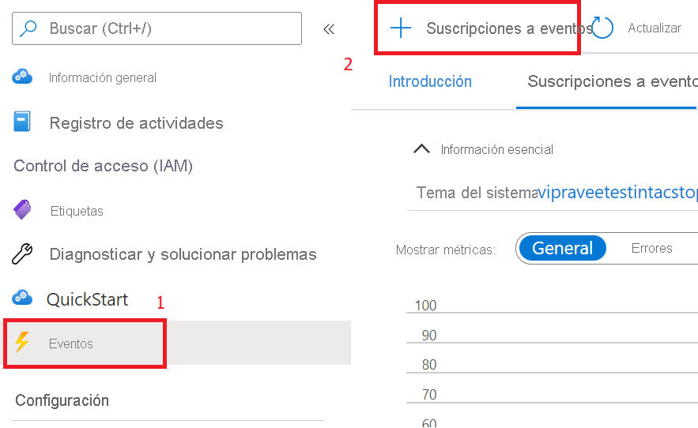

# <a name="record-and-download-calls-with-event-grid"></a>Grabación y descarga de llamadas con Event Grid

[!INCLUDE [Private Preview Notice](../../includes/private-preview-include.md)]

Para empezar a usar Azure Communication Services, grabe las llamadas de Communication Services mediante Azure Event Grid.

## <a name="prerequisites"></a>Requisitos previos
- Una cuenta de Azure con una suscripción activa. [Cree una cuenta gratuita](https://azure.microsoft.com/free/?WT.mc_id=A261C142F).
- Recurso activo de Communication Services. [Creación de un recurso de Communication Services](../create-communication-resource.md?pivots=platform-azp&tabs=windows).
- El paquete NuGet [`Microsoft.Azure.EventGrid`](https://www.nuget.org/packages/Microsoft.Azure.EventGrid/).

## <a name="create-a-webhook-and-subscribe-to-the-recording-events"></a>Creación de un webhook y suscripción a los eventos de grabación
Se usarán *webhooks* y *eventos* para facilitar la grabación de llamadas y las descargas de archivos multimedia. 

En primer lugar, se creará un webhook. El recurso de Communication Services usará Event Grid para enviar una notificación a este webhook cuando se desencadene el evento `recording` y, posteriormente, cuando los elementos multimedia grabados estén listos para descargarse.

Puede escribir su propio webhook personalizado para recibir estas notificaciones de eventos. Es importante que este webhook responda a los mensajes entrantes con el código de validación para suscribir correctamente el webhook al servicio de eventos.

```csharp
[HttpPost]
public async Task<ActionResult> PostAsync([FromBody] object request)
  {
   //Deserializing the request 
    var eventGridEvent = JsonConvert.DeserializeObject<EventGridEvent[]>(request.ToString())
        .FirstOrDefault();
    var data = eventGridEvent.Data as JObject;

    // Validate whether EventType is of "Microsoft.EventGrid.SubscriptionValidationEvent"
    if (string.Equals(eventGridEvent.EventType, EventTypes.EventGridSubscriptionValidationEvent, StringComparison.OrdinalIgnoreCase))
   {
        var eventData = data.ToObject<SubscriptionValidationEventData>();
        var responseData = new SubscriptionValidationResponseData
        {
            ValidationResponse = eventData.ValidationCode
        };
        if (responseData.ValidationResponse != null)
        {
            return Ok(responseData);
        }
    }

    // Implement your logic here.
    ...
    ...
  }
```

El código anterior depende del paquete NuGet `Microsoft.Azure.EventGrid`. Para más información sobre la validación de puntos de conexión de Event Grid, visite la [documentación de validación de puntos de conexión](../../../event-grid/receive-events.md#endpoint-validation).

A continuación, se suscribirá este webhook al evento `recording`:

1. Seleccione la hoja `Events` del recurso de Azure Communication Services.
2. Seleccione `Event Subscription` como se muestra a continuación.

3. Configure la suscripción de eventos y seleccione `Call Recording File Status Update` como `Event Type`. Seleccione `Webhook` como `Endpoint type`.

4. Especifique la dirección URL del webhook en `Subscriber Endpoint`.


Ahora se notificará al webhook cada vez que se use el recurso de Communication Services para grabar una llamada.

## <a name="notification-schema"></a>Esquema de la notificación
Cuando la grabación esté disponible para su descarga, el recurso de Communication Services emitirá una notificación con el siguiente esquema de eventos. Los identificadores de documentos para la grabación se pueden recuperar de los campos `documentId` de cada `recordingChunk`.

```json
{
    "id": string, // Unique guid for event
    "topic": string, // Azure Communication Services resource id
    "subject": string, // /recording/call/{call-id}
    "data": {
        "recordingStorageInfo": {
            "recordingChunks": [
                {
                    "documentId": string, // Document id for retrieving from AMS storage
                    "index": int, // Index providing ordering for this chunk in the entire recording
                    "endReason": string, // Reason for chunk ending: "SessionEnded", "ChunkMaximumSizeExceeded”, etc.
                }
            ]
        },
        "recordingStartTime": string, // ISO 8601 date time for the start of the recording
        "recordingDurationMs": int, // Duration of recording in milliseconds
        "sessionEndReason": string // Reason for call ending: "CallEnded", "InitiatorLeft”, etc.
    },
    "eventType": string, // "Microsoft.Communication.RecordingFileStatusUpdated"
    "dataVersion": string, // "1.0"
    "metadataVersion": string, // "1"
    "eventTime": string // ISO 8601 date time for when the event was created
}

```

## <a name="download-the-recorded-media-files"></a>Descarga de los archivos multimedia grabados

Una vez que se obtiene el identificador del documento del archivo que queremos descargar, llamaremos a las API de Azure Communication Services siguientes para descargar los elementos multimedia y metadatos grabados mediante la autenticación con HMAC.

El tamaño máximo del archivo de grabación es de 1,5 GB. Si se supera este tamaño de archivo, la grabadora dividirá automáticamente los elementos multimedia grabados en varios archivos.

El cliente debe poder descargar todos los archivos multimedia con una única solicitud. Si hay un problema, el cliente puede volver a intentarlo con un encabezado de intervalo para evitar una nueva descarga de los segmentos que ya se han descargado.

Para descargar elementos multimedia grabados: 
- Método: `GET` 
- Dirección URL: https://contoso.communication.azure.com/recording/download/{documentId}?api-version=2021-04-15-preview1

Para descargar metadatos de los elementos multimedia grabados: 
- Método: `GET` 
- Dirección URL: https://contoso.communication.azure.com/recording/download/{documentId}/metadata?api-version=2021-04-15-preview1


### <a name="authentication"></a>Autenticación
Para descargar los metadatos y elementos multimedia grabados, use la autenticación con HMAC para autenticar la solicitud en las API de Azure Communication Services.

Cree un elemento `HttpClient` y agregue los encabezados necesarios con los siguientes elementos `HmacAuthenticationUtils`:

```csharp
  var client = new HttpClient();

  // Set Http Method
  var method = HttpMethod.Get;
  StringContent content = null;

  // Build request
  var request = new HttpRequestMessage
  {
      Method = method, // Http GET method
      RequestUri = new Uri(<Download_Recording_Url>), // Download recording Url
      Content = content // content if required for POST methods
  };

  // Question: Why do we need to pass String.Empty to CreateContentHash() method?
  // Answer: In HMAC authentication, the hash of the content is one of the parameters used to generate the HMAC token.
  // In our case our recording download APIs are GET methods and do not have any content/body to be passed in the request. 
  // However in this case we still need the SHA256 hash for the empty content and hence we pass an empty string. 


  string serializedPayload = string.Empty;

  // Hash the content of the request.
  var contentHashed = HmacAuthenticationUtils.CreateContentHash(serializedPayload);

  // Add HMAC headers.
  HmacAuthenticationUtils.AddHmacHeaders(request, contentHashed, accessKey, method);

  // Make a request to the Azure Communication Services APIs mentioned above
  var response = await client.SendAsync(request).ConfigureAwait(false);
```

#### <a name="hmacauthenticationutils"></a>HmacAuthenticationUtils 
Las utilidades siguientes se pueden usar para administrar el flujo de trabajo de HMAC.

**Creación de código hash de contenido**

```csharp
public static string CreateContentHash(string content)
{
    var alg = SHA256.Create();

    using (var memoryStream = new MemoryStream())
    using (var contentHashStream = new CryptoStream(memoryStream, alg, CryptoStreamMode.Write))
    {
        using (var swEncrypt = new StreamWriter(contentHashStream))
        {
            if (content != null)
            {
                swEncrypt.Write(content);
            }
        }
    }

    return Convert.ToBase64String(alg.Hash);
}
```

**Incorporación de encabezados HMAC**

```csharp
public static void AddHmacHeaders(HttpRequestMessage requestMessage, string contentHash, string accessKey)
{
    var utcNowString = DateTimeOffset.UtcNow.ToString("r", CultureInfo.InvariantCulture);
    var uri = requestMessage.RequestUri;
    var host = uri.Authority;
    var pathAndQuery = uri.PathAndQuery;

    var stringToSign = $"{requestMessage.Method}\n{pathAndQuery}\n{utcNowString};{host};{contentHash}";
    var hmac = new HMACSHA256(Convert.FromBase64String(accessKey));
    var hash = hmac.ComputeHash(Encoding.ASCII.GetBytes(stringToSign));
    var signature = Convert.ToBase64String(hash);
    var authorization = $"HMAC-SHA256 SignedHeaders=date;host;x-ms-content-sha256&Signature={signature}";

    requestMessage.Headers.Add("x-ms-content-sha256", contentHash);
    requestMessage.Headers.Add("Date", utcNowString);
    requestMessage.Headers.Add("Authorization", authorization);
}
```

## <a name="clean-up-resources"></a>Limpieza de recursos
Si quiere limpiar y quitar una suscripción a Communication Services, puede eliminar el recurso o grupo de recursos. Al eliminar el grupo de recursos, también se elimina cualquier otro recurso que esté asociado a él. Obtenga más información sobre la [limpieza de recursos](../create-communication-resource.md?pivots=platform-azp&tabs=windows#clean-up-resources).


## <a name="next-steps"></a>Pasos siguientes
Para más información, consulte los siguientes artículos.

- Consulte [Introducción al ejemplo de llamada web](../../samples/web-calling-sample.md).
- Más información sobre las [Funcionalidades del SDK de llamadas](./calling-client-samples.md?pivots=platform-web)
- Más información sobre [cómo funciona la llamada](../../concepts/voice-video-calling/about-call-types.md)
