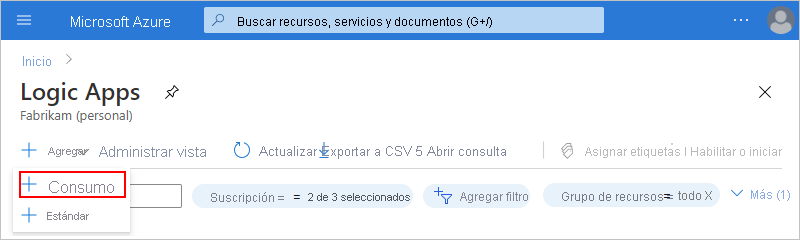
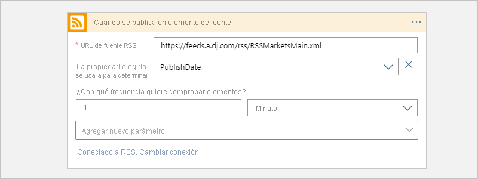
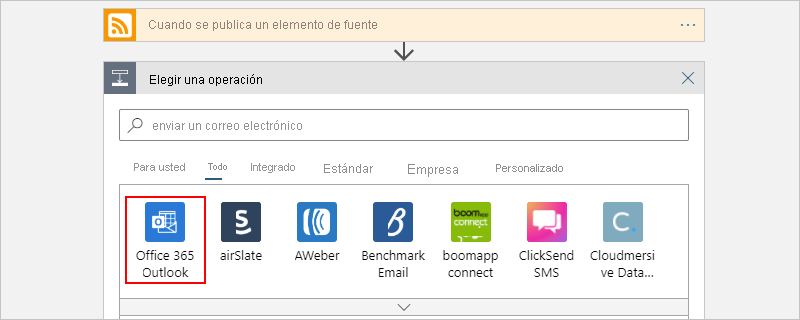
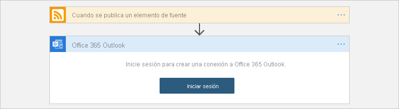

# Inicio rápido: Creación de un flujo de trabajo de integración con Azure Logic Apps en Azure Portal

En este inicio rápido se muestra cómo crear un flujo de trabajo automatizado de ejemplo que integra dos servicios, una fuente RSS para un sitio web y una cuenta de correo electrónico, cuando usa [Azure Logic Apps](logic-apps-overview.md). Aunque este ejemplo está basado en la nube, Logic Apps admite flujos de trabajo que conectan aplicaciones, datos, servicios y sistemas en entornos en la nube, locales e híbridos.

En este ejemplo, creará un flujo de trabajo que usa el conector RSS y el conector de Office 365 Outlook. El conector RSS tiene un desencadenador que comprueba una fuente RSS, según una programación. El conector de Office 365 Outlook tiene una acción que envía un correo electrónico para cada nuevo elemento. Los conectores de este ejemplo son solo dos de los [cientos de conectores](/connectors/connector-reference/connector-reference-logicapps-connectors) que puede usar en un flujo de trabajo.

En la captura de pantalla siguiente se muestra el flujo de trabajo de alto nivel de ejemplo:

A medida que avance en este inicio rápido, aprenderá estos pasos básicos:

* Creación de un recurso de aplicación lógica que se ejecute en el entorno del servicio Logic Apps multiinquilino.
* Selección de la plantilla de aplicación lógica en blanco.
* Incorporación de un desencadenador que especifique cuándo se debe ejecutar el flujo de trabajo.
* Incorporación de una acción que realice una tarea después de que se active el desencadenador.
* Ejecución del flujo de trabajo.

Para crear y administrar una aplicación lógica mediante otras herramientas, revise estos otros inicios rápidos de Logic Apps:

* [Inicio rápido: Creación y administración de definiciones de flujo de trabajo de aplicaciones lógicas mediante Visual Studio Code](quickstart-create-logic-apps-visual-studio-code.md)
* [Inicio rápido: Creación y automatización de tareas, procesos y flujos de trabajo con Azure Logic Apps en Visual Studio](quickstart-create-logic-apps-with-visual-studio.md)
* [Inicio rápido: Creación y administración de aplicaciones lógicas mediante la CLI de Azure](quickstart-logic-apps-azure-cli.md)

## Requisitos previos

* Si no tiene ninguna suscripción a Azure, [cree una cuenta gratuita de Azure](https://azure.microsoft.com/free/?WT.mc_id=A261C142F) antes de empezar.

* Una cuenta de correo electrónico de un servicio que funcione con Azure Logic Apps, como Office 365 Outlook o Outlook.com. Para otros proveedores de correo electrónico admitidos, consulte [Conectores de Logic Apps](/connectors/connector-reference/connector-reference-logicapps-connectors).

  > [!NOTE]
  > Si quiere usar el [conector de Gmail](/connectors/gmail/), solo las cuentas de G-Suite pueden usarlo sin restricciones en Azure Logic Apps. Si tiene una cuenta de consumidor de Gmail, puede usar este conector solo con servicios específicos aprobados por Google, a menos que pueda [crear una aplicación cliente de Google para usarla en la autenticación con el conector de Gmail](/connectors/gmail/#authentication-and-bring-your-own-application). Para más información, consulte [Directivas de privacidad y seguridad de datos de los conectores de Google en Azure Logic Apps](../connectors/connectors-google-data-security-privacy-policy.md).

* Si tiene un firewall que limite el tráfico a direcciones IP específicas, configúrelo para permitir el acceso para *ambas* direcciones IP, la [de entrada](logic-apps-limits-and-config.md#inbound) y la [de salida](logic-apps-limits-and-config.md#outbound), utilizadas por el servicio Logic Apps en la región de Azure donde se encuentra la aplicación lógica.

  En este ejemplo también se usan los conectores RSS y Office 365 Outlook que [administra Microsoft](/connectors/managed.md). Estos conectores requieren que configure el firewall para permitir el acceso a *todas* las [direcciones IP de salida del conector administrado](logic-apps-limits-and-config.md#outbound) en la región de Azure de la aplicación lógica.

## Creación de un recurso de aplicación lógica

1. Inicie sesión en [Azure Portal](https://portal.azure.com) con su cuenta de Azure.

1. En el cuadro de búsqueda de Azure, escriba `logic apps` y seleccione **Logic Apps**.

   

1. En la página **Logic Apps**, seleccione en **Agregar** > **Consumo**.

   Este paso crea un recurso de aplicación lógica que se ejecuta en el entorno del servicio Logic Apps multiinquilino y usa un [modelo de precios de consumo](logic-apps-pricing.md).

   

1. En el panel **Aplicación lógica**, proporcione los detalles básicos y la configuración de la aplicación lógica. Cree un [grupo de recursos](../azure-resource-manager/management/overview.md#terminology) para esta aplicación lógica de ejemplo.

   | Propiedad | Value | Descripción |
   |----------|-------|-------------|
   | **Suscripción** | <*Azure-subscription-name*> | Nombre de la suscripción de Azure. |
   | **Grupos de recursos** | <*nombre del grupo de recursos de Azure*> | El nombre del [grupo de recursos de Azure](../azure-resource-manager/management/overview.md#terminology), que debe ser único en todas las regiones. En este ejemplo se usa "My-First-LA-RG". |
   | **Nombre de la aplicación lógica** | <*nombre-de-la-aplicación-lógica*> | Nombre de la aplicación lógica, que debe ser único en todas las regiones. En este ejemplo se usa "My-First-Logic-App". 

**Importante**: el nombre solo puede contener letras, números, guiones (`-`), caracteres de subrayado (`_`), paréntesis (`(`, `)`) y puntos (`.`).  |
   | **Región** | <*Azure-region*> | La región del centro de datos de Azure donde se almacenará la información de la aplicación. En este ejemplo se utiliza "Oeste de EE. UU.". |
   | **Asociación con el entorno del servicio de integración** | Desactivado | Seleccione esta opción solo cuando desee implementar esta aplicación lógica en un [entorno del servicio de integración](connect-virtual-network-vnet-isolated-environment-overview.md). En este ejemplo, deje esta opción sin seleccionar. |
   | **Habilitación de análisis de registros** | Desactivado | Seleccione esta opción solo cuando desee habilitar el registro de diagnóstico. En este ejemplo, deje esta opción sin seleccionar. |
   ||||

   

1. Seleccione **Revisar y crear** cuando esté preparado. En la página de validación, confirme los detalles que proporcionó y seleccione **Crear**.

## Selección de una plantilla en blanco

1. Una vez que Azure implemente correctamente la aplicación, seleccione **Ir al recurso**. O también puede buscar y seleccionar la aplicación lógica escribiendo el nombre en el cuadro de búsqueda de Azure.

   

   El Diseñador de aplicación lógica se abre y muestra una página con un vídeo de introducción y desencadenadores utilizados frecuentemente.

1. En **Plantillas**, elija **Blank Logic App**.

   

   Después de seleccionar la plantilla, el diseñador muestra ahora una superficie de flujo de trabajo vacía.

## Incorporación del desencadenador

Un flujo de trabajo siempre se inicia con un único [desencadenador](../logic-apps/logic-apps-overview.md#how-do-logic-apps-work), que especifica la condición que se debe cumplir antes de ejecutar cualquier acción del flujo de trabajo. Cada vez que el desencadenador se activa, Azure Logic Apps crea una instancia del flujo de trabajo y la ejecuta. Si el desencadenador no se activa, no se crea ni se ejecuta ninguna instancia. Puede iniciar un flujo de trabajo eligiendo entre muchos desencadenadores diferentes.

En este ejemplo se usa un desencadenador RSS que comprueba una fuente RSS según una programación. Si se encuentra un nuevo elemento en la fuente, el desencadenador se activa y comienza a ejecutarse una nueva instancia del flujo de trabajo. Si se encuentran varios elementos nuevos entre varias comprobaciones, el desencadenador se activa para cada elemento y se ejecuta una nueva instancia del flujo de trabajo independiente para cada elemento.

1. En el **Diseñador de aplicaciones lógicas**, debajo del cuadro de búsqueda, seleccione **Todo**.

1. En el cuadro de búsqueda, escriba `rss` para buscar el desencadenador de RSS. En la lista **Desencadenadores**, seleccione el desencadenador de RSS, **Cuando se publica un elemento de fuente**.

   

1. Escriba la siguiente información en los detalles del desencadenador:

   | Propiedad | Obligatorio | Value | Descripción |
   |----------|----------|-------|-------------|
   | **URL de fuente RSS** | Sí | <*URL-de-fuente-RSS*> | Dirección URL de fuente RSS que se supervisará. 

En este ejemplo se usa la fuente RSS del Wall Street Journal en `https://feeds.a.dj.com/rss/RSSMarketsMain.xml`. Sin embargo, puede usar cualquier fuente RSS que no requiera autorización HTTP. Elija una fuente RSS que publique con frecuencia, para que pueda probar el flujo de trabajo fácilmente. |
   | **La propiedad elegida se usará para determinar** | No | PublishDate | Propiedad que determina qué elementos son nuevos. |
   | **Intervalo** | Sí | 1 | Número de intervalos que se espera entre comprobaciones de la fuente. 

En este ejemplo se usa `1` como intervalo. |
   | **Frecuencia** | Sí | Minuto | Unidad de frecuencia que se usa para cada intervalo. 

En este ejemplo se usa `Minute` como frecuencia. |
   |||||

   

1. Para ocultar por ahora los detalles del desencadenador, haga clic dentro de la barra de título.

   

1. Cuando haya terminado, guarde la aplicación lógica y esta aparecerá al instante en Azure Portal. En la barra de herramientas del diseñador, seleccione **Save** (Guardar).

   El desencadenador no hará nada más que comprobar la fuente RSS. Por lo tanto, debe agregar una acción que defina lo que sucede cuando se activa el desencadenador.

## Agregar una acción

Después de un desencadenador, una [acción](../logic-apps/logic-apps-overview.md#logic-app-concepts) es un paso posterior que ejecuta alguna operación en el flujo de trabajo. Cualquier acción puede usar las salidas del paso anterior que, a su vez, pueden ser el desencadenador de otra acción. Puede elegir entre muchas acciones distintas, agregar varias acciones hasta alcanzar el [límite por flujo de trabajo](logic-apps-limits-and-config.md#definition-limits) e incluso crear diferentes rutas de acceso de acción.

En este ejemplo se usa una acción de Office 365 Outlook que envía un correo electrónico cada vez que el desencadenador se activa por un nuevo elemento de la fuente RSS. Si se encuentran varios elementos nuevos entre comprobaciones, recibirá varios correos electrónicos.

1. En el desencadenador **Cuando se publica un elemento de fuente**, elija **Nuevo paso**.

   

1. En **Elegir una operación** y en el cuadro de búsqueda, seleccione **Todas**.

1. En el cuadro de búsqueda, escriba `send an email` para buscar conectores que ofrezcan esta acción. Para filtrar la lista de **acciones** de una aplicación o un servicio específicos, seleccione la aplicación o servicio primero.

   Por ejemplo, si tiene una cuenta profesional o educativa de Microsoft y desea usar Office 365 Outlook, seleccione **Office 365 Outlook**. O bien, si tiene una cuenta Microsoft personal, seleccione **Outlook.com**. Este ejemplo continúa con Office 365 Outlook.

   > [!NOTE]
   > Si usa un servicio de correo electrónico compatible diferente en el flujo de trabajo, la interfaz de usuario podría tener un aspecto ligeramente diferente. Sin embargo, los conceptos básicos para conectarse a otro servicio de correo electrónico son los mismos.

   

   Ahora puede encontrar y seleccionar con más facilidad la acción que desea usar como, por ejemplo, **Enviar un correo electrónico**:

   

1. Si el servicio de correo electrónico seleccionado le pide que inicie sesión y que autentique su identidad, complete ese paso ahora.

   Muchos conectores requieren que primero cree una conexión y autentique su identidad antes de poder continuar.

   

   > [!NOTE]
   > En este ejemplo se muestra la autenticación manual para conectarse a Office 365 Outlook. Sin embargo, otros servicios pueden admitir o usar tipos de autenticación diferentes. Según el escenario, puede controlar la autenticación de la conexión de varias maneras.
   > 
   > Por ejemplo, si se usan plantillas de Azure Resource Manager para la implementación, es posible parametrizar valores, como la información de conexión, para aumentar la seguridad de las entradas que cambian con frecuencia. Para obtener más información, consulte estos temas:
   >
   > * [Parámetros de plantilla para la implementación](../logic-apps/logic-apps-azure-resource-manager-templates-overview.md#template-parameters)
   > * [Autorización de conexiones de OAuth](../logic-apps/logic-apps-deploy-azure-resource-manager-templates.md#authorize-oauth-connections)
   > * [Autenticación y acceso con identidades administradas](../logic-apps/create-managed-service-identity.md)
   > * [Autenticación de conexiones para la implementación de aplicaciones lógicas](../logic-apps/logic-apps-azure-resource-manager-templates-overview.md#authenticate-connections)

1. En la acción **Enviar un correo electrónico**, especifique la información que desea incluir en el correo electrónico.

   1. En el cuadro **Para**, escriba la dirección de correo electrónico del destinatario. Para este ejemplo, utilice su dirección de correo electrónico.

      > [!NOTE]
      > La lista **Agregar contenido dinámico** aparece al hacer clic en el cuadro **Para** y en otros cuadros para determinados tipos de entradas. En esta lista se muestran las salidas de los pasos anteriores que están disponibles para que las seleccione como entradas de la acción actual. Puede pasar por alto esta lista por ahora. En el paso siguiente se usa la lista de contenido dinámico.

   1. En el cuadro **Asunto**, escriba el asunto del correo electrónico. Para este ejemplo, escriba el texto siguiente con un espacio en blanco al final: `New RSS item: `

      

   1. En la lista **Agregar contenido dinámico**, en **Cuando se publica un elemento de fuente**, seleccione **Título de fuente**.

      El título de fuente es una salida de desencadenador que hace referencia al título del elemento RSS. El correo electrónico usa esta salida para mostrar el título del elemento RSS.

      

      > [!TIP]
      > En la lista de contenido dinámico, si no aparece ninguna salida del desencadenador **Cuando se publica un elemento de fuente**, junto al encabezado de la acción, seleccione **Ver más**.
      > 
      > 

      Cuando haya terminado, el asunto del correo electrónico será similar a este ejemplo:

      

      > [!NOTE]
      > Si aparece un bucle **For each** en el diseñador, ha seleccionado una salida que hace referencia a una matriz como, por ejemplo, la propiedad **categories-Item**. Para este tipo de salida, el diseñador agrega automáticamente el bucle **For each** en la acción que hace referencia a la salida. De este modo, el flujo de trabajo realiza la misma acción en cada elemento de la matriz. 
      >
      > Para quitar el bucle, en la barra de título del mismo, seleccione el botón de puntos suspensivos ( **...** ) y, luego, **Eliminar**.

   1. En el cuadro **Cuerpo**, escriba el contenido del cuerpo del correo electrónico.
   
      En este ejemplo, el cuerpo incluye las siguientes propiedades precedidas de texto descriptivo para cada propiedad. Para agregar líneas en blanco en el cuadro de edición, presione Mayús + Entrar.

      | Texto descriptivo | Propiedad | Descripción |
      |------------------|----------|-------------|
      | `Title:` | **Título de fuente** | Título del elemento |
      | `Date published:` | **Fuente publicada el** | Fecha y hora de publicación del elemento |
      | `Link:` | **Vínculo de fuente principal** | Dirección URL del elemento |
      ||||

      

1. Guarde la aplicación lógica. En la barra de herramientas del diseñador, seleccione **Save** (Guardar).

## Ejecución del flujo de trabajo

Para comprobar que el flujo de trabajo se ejecuta correctamente, puede esperar a que el desencadenador compruebe la fuente RSS según la programación establecida. O bien, puede ejecutar manualmente el flujo de trabajo; para ello, seleccione **Ejecutar** en la barra de herramientas del diseñador de aplicaciones lógicas, tal como se muestra en la siguiente captura de pantalla. 

Si la fuente RSS tiene nuevos elementos, el flujo de trabajo envía un correo electrónico para cada uno de ellos. En caso contrario, el flujo de trabajo espera hasta el siguiente intervalo para comprobar de nuevo la fuente RSS. 

En la captura de pantalla siguiente se muestra un correo electrónico de ejemplo que envía el flujo de trabajo de ejemplo. El correo electrónico incluye los detalles de cada salida del desencadenador que seleccionó, además del texto descriptivo que incluyó para cada elemento.

## Solucionar problemas

Si no recibe correos electrónicos del flujo de trabajo según lo previsto:

* Compruebe la carpeta de correo no deseado de la cuenta de correo electrónico, por si el mensaje se ha filtrado incorrectamente.
* Asegúrese de que la fuente RSS que usa ha publicado elementos desde la última comprobación programada o manual.

## Limpieza de recursos

Cuando haya terminado este inicio rápido, limpie la aplicación lógica de ejemplo y los recursos relacionados; para ello, elimine el grupo de recursos que creó para este ejemplo.

1. En el cuadro de búsqueda de Azure, escriba `resource groups` y seleccione **Grupos de recursos**.

   

1. Busque y seleccione el grupo de recursos de la aplicación lógica. En el panel **Información general**, elija **Eliminar grupo de recursos**.

   

1. Cuando aparezca el panel de confirmación, escriba el nombre del grupo de recursos y seleccione **Eliminar**.

   

## Pasos siguientes

En este inicio rápido, ha creado su primer flujo de trabajo de aplicación lógica en Azure Portal para comprobar una fuente RSS y enviar un correo electrónico para cada nuevo elemento. Para más información sobre los flujos de trabajo programados avanzados, consulte el siguiente tutorial:

> [!div class="nextstepaction"]
> [Comprobación del tráfico con una aplicación lógica basada en una programación](../logic-apps/tutorial-build-schedule-recurring-logic-app-workflow.md)