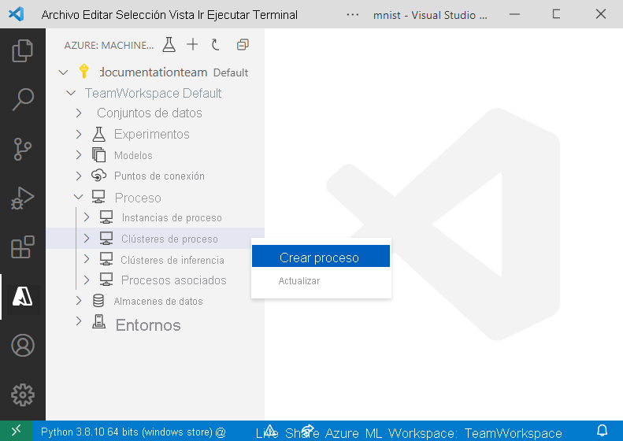

# <a name="train-an-image-classification-tensorflow-model-using-the-azure-machine-learning-visual-studio-code-extension-preview"></a>Entrene un modelo de TensorFlow de clasificación de imágenes con la extensión Azure Machine Learning para Visual Studio Code (versión preliminar).

Obtenga información sobre el entrenamiento de un modelo de TensorFlow de clasificación de imágenes para el reconocimiento de números manuscritos con la extensión Azure Machine Learning para Visual Studio Code.

En este tutorial, ha aprendido las tareas siguientes:

> [!div class="checklist"]
> * Comprendiendo el código
> * Crear un área de trabajo
> * Creación de un clúster de GPU para entrenamiento
> * Entrenamiento de un modelo

## <a name="prerequisites"></a>Requisitos previos

- Suscripción de Azure. Si no tiene una, regístrese para probar la [versión gratuita o de pago de Azure Machine Learning](https://aka.ms/AMLFree).
- Instale [Visual Studio Code](https://code.visualstudio.com/docs/setup/setup-overview), un editor de código ligero y multiplataforma.
- Extensión Azure Machine Learning Studio para Visual Studio Code Para obtener instrucciones de instalación, consulte la [guía de configuración de la extensión Azure Machine Learning para Visual Studio Code](./how-to-setup-vs-code.md).
- CLI 2.0 (versión preliminar). Para obtener instrucciones de instalación, consulte [Instalación, configuración y uso de la CLI 2.0 (versión preliminar)](how-to-configure-cli.md)

## <a name="understand-the-code"></a>Comprendiendo el código

El código de este tutorial usa TensorFlow para entrenar un modelo de aprendizaje automático de clasificación de imágenes que clasifica dígitos manuscritos de 0 a 9. Para ello, crea una red neuronal que toma los valores de píxeles de una imagen de 28 x 28 píxeles como entrada y genera una lista de 10 probabilidades, una para cada uno de los dígitos que se están clasificando. A continuación se muestra un ejemplo del aspecto de los datos.  


Para obtener el código de este tutorial, descargue y descomprima el [repositorio de ejemplos de Azure Machine Learning](https://github.com/Azure/azureml-examples/archive/refs/heads/main.zip) donde quiera en el equipo.

## <a name="create-a-workspace"></a>Crear un área de trabajo

Lo primero que hay que hacer para compilar una aplicación en Azure Machine Learning es crear un área de trabajo. Un área de trabajo contiene los recursos para entrenar modelos, así como los propios modelos entrenados. Para más información, consulte [Qué es un área de trabajo](./concept-workspace.md).

1. Abra el directorio *azureml-examples-main/cli/jobs/train/tensorflow/mnist* en Visual Studio Code.
1. En la barra de actividad de Visual Studio Code, haga clic en el icono de **Azure** para abrir la vista de Azure Machine Learning.
1. En la vista de Azure Machine Learning, haga clic con el botón derecho en el nodo de suscripción y seleccione **Crear área de trabajo**.

    > [!div class="mx-imgBorder"]
    > 

1. Aparecerá un archivo de especificación. Configure dicho archivo con las siguientes opciones. 

    ```yml
    $schema: https://azuremlschemas.azureedge.net/latest/workspace.schema.json
    name: TeamWorkspace
    location: WestUS2
    friendly_name: team-ml-workspace
    description: A workspace for training machine learning models
    tags:
      purpose: training
      team: ml-team
    ```

    El archivo de especificación crea un área de trabajo denominada `TeamWorkspace` en la región `WestUS2`. El resto de las opciones definidas en el archivo de especificación proporcionan nombres descriptivos, descripciones y etiquetas para el área de trabajo.

1. Haga clic con el botón derecho en el archivo de especificación y seleccione **Azure ML: Crear recurso**. La creación de un recurso utiliza las opciones de configuración definidas en el archivo de especificación YAML y envía un trabajo mediante la CLI 2.0. En este momento, se realiza una solicitud a Azure para crear una nueva área de trabajo y recursos dependientes en su cuenta. Después de unos minutos, la nueva área de trabajo aparece en el nodo de la suscripción.
1. Establezca `TeamWorkspace` como el área de trabajo predeterminada. Al hacerlo, se colocan de forma predeterminada los recursos y trabajos que se crean en el área de trabajo. Seleccione el botón **Set Azure ML Workspace** (Establecer área de trabajo de Azure Machine Learning) en la barra de estado de Visual Studio Code y siga las indicaciones para establecer `TeamWorkspace` como área de trabajo predeterminada.

Para más información sobre las áreas de trabajo, consulte [cómo administrar recursos en VS Code](how-to-manage-resources-vscode.md).

## <a name="create-a-gpu-cluster-for-training"></a>Creación de un clúster de GPU para entrenamiento

Un destino de proceso es el recurso informático o el entorno donde se ejecutan los trabajos de entrenamiento. Para más información, consulte la [documentación sobre destinos de proceso de Azure Machine Learning](./concept-compute-target.md).

1. En la vista de Azure Machine Learning, expanda el nodo del área de trabajo.
1. Haga clic con el botón derecho en el nodo **Compute clusters** (Clúster de proceso) en el nodo **Compute** (Proceso) del área de trabajo y seleccione **Create Compute** (Creación de un proceso).

    > [!div class="mx-imgBorder"]
    > 

1. Aparecerá un archivo de especificación. Configure dicho archivo con las siguientes opciones.

    ```yml
    $schema: https://azuremlschemas.azureedge.net/latest/compute.schema.json
    name: gpu-cluster
    type: amlcompute
    size: Standard_NC12
    
    min_instances: 0
    max_instances: 3
    idle_time_before_scale_down: 120
    ```

    El archivo de especificación crea un clúster de GPU llamado `gpu-cluster` con un máximo de tres nodos de máquina virtual Standard_NC12 que se reduce verticalmente a 0 nodos después de 120 segundos de inactividad.

    Para más información sobre los tamaños de máquina virtual, consulte [Tamaños de las máquinas virtuales Linux en Azure](../virtual-machines/sizes.md).

1. Haga clic con el botón derecho en el archivo de especificación y seleccione **Azure ML: Crear recurso**.

Después de unos minutos, el nuevo destino de proceso aparece en el nodo *Compute > Compute clusters* (Proceso > Clústeres de proceso) del área de trabajo.

## <a name="train-image-classification-model"></a><a name="train-the-model"></a> Entrenamiento de un modelo de clasificación de imágenes

Durante el proceso de entrenamiento, se entrena un modelo de TensorFlow mediante el procesamiento de los datos de entrenamiento y los patrones de aprendizaje insertados en él para cada uno de los dígitos respectivos que se clasifican.

Al igual que las áreas de trabajo y los destinos de proceso, los trabajos de entrenamiento se definen mediante plantillas de recursos. En este ejemplo, el archivo de especificación se define en el archivo *job.yml* con un aspecto similar al siguiente:

```yml
$schema: https://azuremlschemas.azureedge.net/latest/commandJob.schema.json
code: 
    local_path: src
command: >
    python train.py
environment: azureml:AzureML-TensorFlow2.4-Cuda11-OpenMpi4.1.0-py36:1
compute:
    target: azureml:gpu-cluster
experiment_name: tensorflow-mnist-example
description: Train a basic neural network with TensorFlow on the MNIST dataset.
```

Este archivo de especificación envía un trabajo de entrenamiento llamado `tensorflow-mnist-example` al destino de proceso `gpu-cluster` creado recientemente que ejecuta el código en el script de Python *train.py*. El entorno utilizado es uno de los entornos seleccionados que proporciona Azure Machine Learning y que contiene TensorFlow y otras dependencias de software necesarias para ejecutar el script de entrenamiento. Para más información sobre los entornos seleccionados, consulte [Entornos mantenidos de Azure Machine Learning](resource-curated-environments.md).

Para enviar el trabajo de entrenamiento:

1. Abra el archivo *job.yml.* .
1. Haga clic con el botón derecho en el archivo en el editor de texto y seleccione **Azure ML: Create Resource** (Azure ML: Crear recurso).

> [!div class="mx-imgBorder"]
> 

En este momento, se envía una solicitud a Azure para ejecutar el experimento en el destino de proceso seleccionado en el área de trabajo. Este proceso tarda varios minutos. La cantidad de tiempo que se tarda en ejecutar el trabajo de entrenamiento se ve afectada por varios factores, como el tipo de proceso y el tamaño de los datos de entrenamiento. Para realizar un seguimiento del progreso del experimento, haga clic con el botón derecho en el nodo de ejecución actual y seleccione **View Run in Azure Portal** (Ver ejecución en Azure Portal).

Cuando aparezca el cuadro de diálogo que solicita abrir un sitio web externo, seleccione **Abrir**.

> [!div class="mx-imgBorder"]
> 

Cuando se realiza el entrenamiento del modelo, la etiqueta de estado junto al nodo de ejecución se actualiza a "Completado".

## <a name="next-steps"></a>Pasos siguientes

En este tutorial, ha aprendido las tareas siguientes:

> [!div class="checklist"]
> * Comprendiendo el código
> * Crear un área de trabajo
> * Creación de un clúster de GPU para entrenamiento
> * Entrenamiento de un modelo

Siga estos pasos:

* [Cree y administre recursos de Azure Machine Learning con Visual Studio Code](how-to-set-up-vs-code-remote.md).
* [Conecte Visual Studio Code a una instancia de proceso](how-to-set-up-vs-code-remote.md) para obtener una experiencia de desarrollo completa.
* Para ver un tutorial sobre cómo editar, ejecutar y depurar código de forma local, consulte el [tutorial de hello world de Python](https://code.visualstudio.com/docs/Python/Python-tutorial).
* [Ejecute Jupyter Notebooks en Visual Studio Code](how-to-manage-resources-vscode.md) mediante un servidor remoto de Jupyter.
* Para ver un tutorial sobre cómo entrenar con Azure Machine Learning fuera de Visual Studio Code, consulte [Tutorial: Entrenamiento de modelos con Azure Machine Learning](tutorial-train-models-with-aml.md).