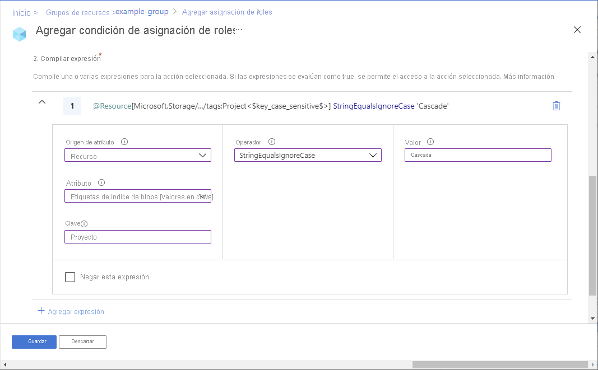

# Incorporación o edición de condiciones de asignación de roles de Azure mediante Azure Portal (versión preliminar)

> [!IMPORTANT]
> Las condiciones de asignación de roles de Azure y Azure ABAC se encuentran actualmente en versión preliminar.
> Esta versión preliminar se ofrece sin Acuerdo de Nivel de Servicio y no se recomienda para cargas de trabajo de producción. Es posible que algunas características no sean compatibles o que tengan sus funcionalidades limitadas.
> Para más información, consulte [Términos de uso complementarios de las Versiones Preliminares de Microsoft Azure](https://azure.microsoft.com/support/legal/preview-supplemental-terms/).

Una [condición de asignación de roles de Azure](conditions-overview.md) es una comprobación adicional que puede agregar opcionalmente a la asignación de roles para proporcionar un control de acceso más preciso. Por ejemplo, puede agregar una condición que requiera que un objeto tenga una etiqueta específica para leer el objeto. En este artículo se describe cómo agregar, editar, ver o eliminar condiciones para las asignaciones de roles mediante Azure Portal.

## Requisitos previos

Para obtener información sobre los requisitos previos para agregar o editar condiciones de asignación de roles, consulte [Requisitos previos de las condiciones](conditions-prerequisites.md).

## Paso 1: Determinar la condición que necesita

Para determinar las condiciones que necesita, revise los ejemplos del [Ejemplo de condiciones de asignación de roles de Azure](../storage/common/storage-auth-abac-examples.md).

Actualmente, se pueden agregar condiciones a asignaciones de roles integradas o personalizadas que tienen [acciones de datos de Storage Blob](../storage/common/storage-auth-abac-attributes.md). Entre estas se incluyen los siguientes roles integrados:

- [Colaborador de datos de blobs de almacenamiento](built-in-roles.md#storage-blob-data-contributor)
- [Propietario de datos de blobs de almacenamiento](built-in-roles.md#storage-blob-data-owner)
- [Lector de datos de blobs de almacenamiento](built-in-roles.md#storage-blob-data-reader)

## Paso 2: Decidir cómo agregar una condición

Puede agregar una condición de dos maneras. Puede agregar una condición cuando agregue una nueva asignación de roles, o puede agregar una condición a una asignación de roles existente.

### Nueva asignación de rol

1. Siga los pasos de [Asignación de roles de Azure mediante Azure Portal](role-assignments-portal.md).

1. En la pestaña **Condición**, haga clic en **Agregar condición**.

    Si no aparece la pestaña Condición, asegúrese de haber seleccionado un rol que admita condiciones.

   

    Se muestra la página para agregar una condición de asignación de roles.

### Asignación de roles existente

1. En Azure Portal, abra **Control de acceso (IAM)** en el ámbito en el que quiere agregar una condición. Por ejemplo, puede abrir una suscripción, un grupo de recursos o un recurso.

    En este momento no puede usar Azure Portal para agregar, ver, editar o eliminar una adición de condición en el ámbito de un grupo de administración.

1. Haga clic en la pestaña **Asignaciones de roles** para ver todas las asignaciones de roles en este ámbito.

1. Busque una asignación de roles que tenga acciones de datos de almacenamiento a las que quiera agregar una condición.

1. En la columna **Condición**, haga clic en **Agregar**.

    Si no ve el vínculo Agregar, asegúrese de que está viendo el mismo ámbito de la asignación de roles.

    

    Se muestra la página para agregar una condición de asignación de roles.

## Paso 3: Revisar los aspectos básicos

Una vez abierta la página para agregar una condición de asignación de roles, puede revisar los aspectos básicos de la condición. **Rol** indica el rol al que se agregará la condición.

1. En la opción **Editor type** (tipo de editor), deje seleccionada la opción predeterminada **Visual**.

    Una vez que haya agregado una condición, podrá alternar entre Visual y Código.

1. (Opcional) Si aparece el cuadro **Descripción**, escriba una descripción.

    En función de cómo haya elegido agregar la condición, es posible que no se muestre el cuadro Descripción. Una descripción puede ayudarle a comprender y recordar la condición.

    

## Paso 4: Agregar acciones

1. En la sección **Agregar acción**, haga clic en **Agregar acción**.

    Se muestra el panel Selección de una acción. Este panel es una lista filtrada de acciones de datos basada en la asignación de roles que será el destino de la condición. Para más información, consulte [Formato y sintaxis de la condición de asignación de roles de Azure](conditions-format.md#actions).

    

1. Seleccione las acciones que quiera permitir si se cumple la condición pertinente.

    Si selecciona varias acciones para una condición única, puede que tenga menos atributos para elegir para la condición, ya que los atributos deben estar disponibles en todas las acciones seleccionadas.

1. Haga clic en **Seleccionar**.

    Las acciones seleccionadas aparecen en la lista de acciones.

## Paso 5: Generar expresiones

1. En la sección **Build expression** (generación de expresión), haga clic en **Agregar expresión**.

    Se expandirá la sección Expresiones.

1. En la lista Origen del atributo, seleccione dónde se puede encontrar el atributo.

    - **Recurso** indica que el atributo está en el recurso, como el nombre del contenedor.
    - **Solicitud** indica que el atributo forma parte de la solicitud de acción, como establecer la etiqueta de índice de blobs.

1. En la lista Atributo, seleccione un atributo para el lado izquierdo de la expresión. Para más información, consulte [Formato y sintaxis de la condición de asignación de roles de Azure](conditions-format.md#attributes).

    Según el atributo que seleccione, se pueden agregar cuadros para especificar detalles adicionales del atributo.

1. En la lista Operador, seleccione un operador.

1. En el cuadro Valor, escriba un valor para el lado derecho de la expresión.

    

## Paso 6: Revisar y agregar una condición

1. Desplácese hacia arriba hasta **Editor type** (tipo de editor) y haga clic en **Código**.

    La condición se muestra en forma de código. En este editor de código se pueden realizar cambios en la condición. Para volver a emplear el editor visual, haga clic en **Visual**.

    

1. Haga clic en **Guardar** para agregar la condición a la asignación de roles.

## Visualización, edición o eliminación de una condición

1. En Azure Portal, abra **Control de acceso (IAM)** para la asignación de roles que tiene una condición que quiera ver, editar o eliminar.

1. Haga clic en la pestaña **Asignaciones de roles** y busque la asignación de roles.

1. En la columna **Condición**, haga clic en **Ver/Editar**.

    Si no ve el vínculo Ver/Editar, asegúrese de que está viendo el mismo ámbito de la asignación de roles.

    

    Se muestra la página para agregar una condición de asignación de roles.

1. Use el editor para ver o editar la condición.

    

1. Cuando termine, haga clic en **Guardar**. Para eliminar toda la condición, haga clic en **Eliminar condición**. Al eliminar la condición no se quita la asignación de roles.

## Pasos siguientes

- [Condiciones de asignación de roles de Azure de ejemplo (versión preliminar)](../storage/common/storage-auth-abac-examples.md)
- [Tutorial: Adición de una condición de asignación de roles para restringir el acceso a blobs mediante Azure Portal (versión preliminar)](../storage/common/storage-auth-abac-portal.md)
- [Solución de problemas de las condiciones de asignación de roles de Azure (versión preliminar)](conditions-troubleshoot.md)
