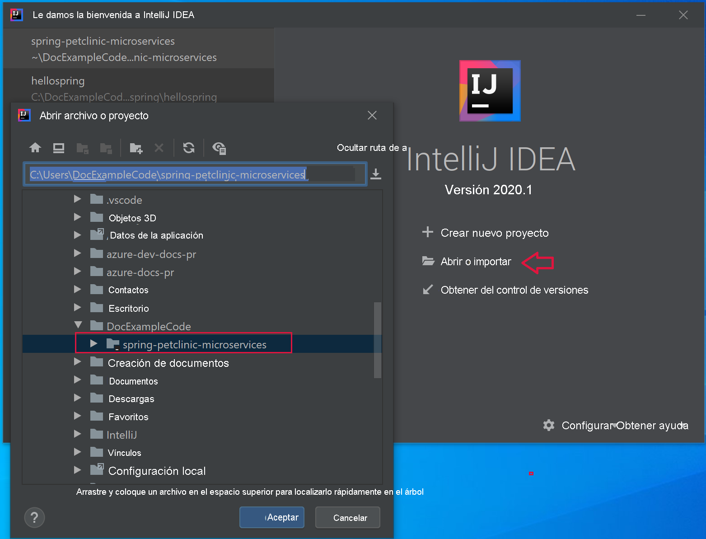
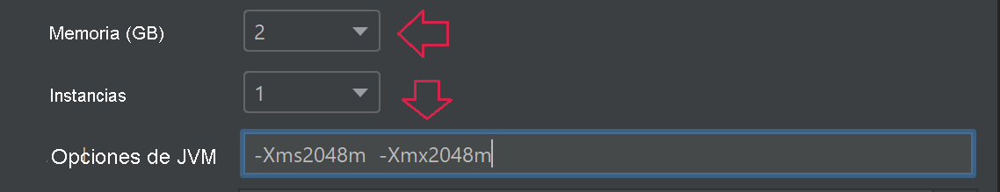

# <a name="quickstart-build-and-deploy-apps-to-azure-spring-cloud"></a>Inicio rápido: Compilación e implementación de aplicaciones en Azure Spring Cloud

::: zone pivot="programming-language-csharp"
En esta guía de inicio rápido, se compilan e implementan aplicaciones de microservicios en Azure Spring Cloud mediante la CLI de Azure.

## <a name="prerequisites"></a>Requisitos previos

* Complete las guías de inicio rápido anteriores de esta serie:

  * [Aprovisionamiento del servicio Azure Spring Cloud](./quickstart-provision-service-instance.md).
  * [Configuración del servidor de configuración de Azure Spring Cloud](./quickstart-setup-config-server.md).

## <a name="download-the-sample-app"></a>Descarga de la aplicación de ejemplo

Si ha estado usando Azure Cloud Shell hasta este momento, cambie a un símbolo del sistema local para los pasos siguientes.

1. Cree una carpeta y clone el repositorio de la aplicación de ejemplo.

   ```console
   mkdir source-code
   ```

   ```console
   cd source-code
   ```

   ```console
   git clone https://github.com/Azure-Samples/Azure-Spring-Cloud-Samples
   ```

1. Navegue al directorio del repositorio.

   ```console
   cd Azure-Spring-Cloud-Samples
   ```

## <a name="deploy-planetweatherprovider"></a>Implementación de PlanetWeatherProvider

1. Cree una aplicación para el proyecto PlanetWeatherProvider en la instancia de Azure Spring Cloud.

   ```azurecli
   az spring-cloud app create --name planet-weather-provider --runtime-version NetCore_31
   ```

   Para habilitar el registro automático de servicios, ha dado a la aplicación el mismo nombre que el valor de `spring.application.name` en el archivo *appsettings.json* del proyecto:

   ```json
   "spring": {
     "application": {
       "name": "planet-weather-provider"
     }
   }
   ```

   La ejecución de este comando puede llevar varios minutos.

1. Cambie el directorio a la carpeta del proyecto `PlanetWeatherProvider`.

   ```console
   cd steeltoe-sample/src/planet-weather-provider
   ```

1. Cree los archivos binarios y el archivo *.zip* que se va a implementar.

   ```console
   dotnet publish -c release -o ./publish
   ```

   > [!TIP]
   > El archivo del proyecto contiene el siguiente código XML para empaquetar los archivos binarios en un archivo *.zip* después de escribirlos en la carpeta *./publish*:
   >
   > ```xml
   > <Target Name="Publish-Zip" AfterTargets="Publish">
   >   <ZipDirectory SourceDirectory="$(PublishDir)" DestinationFile="$(MSBuildProjectDirectory)/publish-deploy-planet.zip" Overwrite="true" />
   > </Target>
   > ```

1. Implemente en Azure.

   Asegúrese de que el símbolo del sistema se encuentre en la carpeta del proyecto antes de ejecutar el siguiente comando.

   ```console
   az spring-cloud app deploy -n planet-weather-provider --runtime-version NetCore_31 --main-entry Microsoft.Azure.SpringCloud.Sample.PlanetWeatherProvider.dll --artifact-path ./publish-deploy-planet.zip
   ```

   La opción `--main-entry` especifica la ruta de acceso relativa de la carpeta raíz del archivo *.zip* al archivo *.dll* que contiene el punto de entrada de la aplicación. Una vez que el servicio carga el archivo *.zip*, extrae todos los archivos y carpetas e intenta ejecutar el punto de entrada en el archivo *.dll* especificado.

   La ejecución de este comando puede llevar varios minutos.

## <a name="deploy-solarsystemweather"></a>Implementación de SolarSystemWeather

1. Cree otra aplicación en la instancia de Azure Spring Cloud, esta vez para el proyecto SolarSystemWeather:

   ```azurecli
   az spring-cloud app create --name solar-system-weather --runtime-version NetCore_31
   ```

   `solar-system-weather` es el nombre que se especifica en el archivo *appsettings.json* del proyecto `SolarSystemWeather`.

   La ejecución de este comando puede llevar varios minutos.

1. Cambie el directorio al proyecto `SolarSystemWeather`.

   ```console
   cd ../solar-system-weather
   ```

1. Cree los archivos binarios y el archivo *.zip* que se va a implementar.

   ```console
   dotnet publish -c release -o ./publish
   ```

1. Implemente en Azure.

   ```console
   az spring-cloud app deploy -n solar-system-weather --runtime-version NetCore_31 --main-entry Microsoft.Azure.SpringCloud.Sample.SolarSystemWeather.dll --artifact-path ./publish-deploy-solar.zip
   ```
   
   La ejecución de este comando puede llevar varios minutos.

## <a name="assign-public-endpoint"></a>Asignación del punto de conexión público

Para probar la aplicación, envíe una solicitud HTTP GET a la aplicación `solar-system-weather` desde un explorador.  Para ello, necesita un punto de conexión público para la solicitud.

1. Para asignar el punto de conexión, ejecute el comando siguiente.

   ```azurecli
   az spring-cloud app update -n solar-system-weather --assign-endpoint true
   ```

1. Para obtener la dirección URL del punto de conexión, ejecute el comando siguiente.

   Windows:

   ```azurecli
   az spring-cloud app show -n solar-system-weather -o table
   ```

   Linux:

   ```azurecli
   az spring-cloud app show --name solar-system-weather | grep url
   ```

## <a name="test-the-application"></a>Prueba de la aplicación

Envíe una solicitud GET a la aplicación `solar-system-weather`. En un explorador, vaya a la dirección URL pública con `/weatherforecast` anexado al final de esta. Por ejemplo:

```
https://servicename-solar-system-weather.azuremicroservices.io/weatherforecast
```

El resultado JSON es:

```json
[{"Key":"Mercury","Value":"very warm"},{"Key":"Venus","Value":"quite unpleasant"},{"Key":"Mars","Value":"very cool"},{"Key":"Saturn","Value":"a little bit sandy"}]
```

Esta respuesta muestra que ambas aplicaciones de microservicio funcionan. La aplicación `SolarSystemWeather` devuelve los datos recuperados de la aplicación `PlanetWeatherProvider`.
::: zone-end
---
::: zone pivot="programming-language-java"
En este documento se explica cómo compilar e implementar aplicaciones de microservicios en Azure Spring Cloud mediante:
* la CLI de Azure
* Complemento de Maven
* Intellij

Antes de realizar la implementación mediante la CLI de Azure o Maven, complete los ejemplos que [aprovisionan una instancia de Azure Spring Cloud](./quickstart-provision-service-instance.md) y [configure el servidor de configuración](./quickstart-setup-config-server.md).

## <a name="prerequisites"></a>Requisitos previos

* [Instalación de JDK 8](/java/azure/jdk/)
* [Registro para obtener una suscripción a Azure](https://azure.microsoft.com/free/)
* (Opcional) [Instale la versión 2.0.67 de la CLI de Azure, o cualquier versión superior](/cli/azure/install-azure-cli), e instale la extensión de Azure Spring Cloud con el comando `az extension add --name spring-cloud`
* (Opcional) [Instale Azure Toolkit for IntelliJ](https://plugins.jetbrains.com/plugin/8053-azure-toolkit-for-intellij/) e [inicie sesión](/azure/developer/java/toolkit-for-intellij/create-hello-world-web-app#installation-and-sign-in).

## <a name="deployment-procedures"></a>Procedimientos de implementación

#### <a name="cli"></a>[CLI](#tab/Azure-CLI)

## <a name="build-the-microservices-applications-locally"></a>Compilación local de aplicaciones de microservicios

1. Clone el repositorio de la aplicación de ejemplo en su cuenta de Azure Cloud.  Cambie el directorio y cree el proyecto. 

    ```azurecli
    git clone https://github.com/azure-samples/spring-petclinic-microservices
    cd spring-petclinic-microservices
    mvn clean package -DskipTests -Denv=cloud
    ```
La creación del proyecto tarda aproximadamente de 5 a 10 minutos. Una vez completado, debe tener archivos JAR individuales para cada servicio en sus respectivas carpetas.

## <a name="create-and-deploy-apps-on-azure-spring-cloud"></a>Creación e implementación de aplicaciones en Azure Spring Cloud

1. Cree los 2 microservicios principales para PetClinic: puerta de enlace de API y customers-service.

    ```azurecli
    az spring-cloud app create --name api-gateway --instance-count 1 --memory 2 --assign-endpoint
    az spring-cloud app create --name customers-service --instance-count 1 --memory 2
    ```

1. Implemente los archivos JAR creados en el paso anterior.

    ```azurecli
    az spring-cloud app deploy --name api-gateway --jar-path spring-petclinic-api-gateway/target/spring-petclinic-api-gateway-2.3.6.jar --jvm-options="-Xms2048m -Xmx2048m"
    az spring-cloud app deploy --name customers-service --jar-path spring-petclinic-customers-service/target/spring-petclinic-customers-service-2.3.6.jar --jvm-options="-Xms2048m -Xmx2048m"
    ```

1. Consulte el estado de la aplicación después de las implementaciones con el siguiente comando.

    ```azurecli
    az spring-cloud app list -o table
    ```

    ```txt
        Name               Location    ResourceGroup    Production Deployment    Public Url                                           Provisioning Status    CPU    Memory    Running Instance    Registered Instance    Persistent Storage
    -----------------  ----------  ---------------  -----------------------  ---------------------------------------------------  ---------------------  -----  --------  ------------------  ---------------------  --------------------
    api-gateway        eastus      xxxxxx-sp         default                  https://<service name>-api-gateway.azuremicroservices.io   Succeeded              1      2         1/1                 1/1                    -     
    customers-service  eastus      <service name>         default                                                                       Succeeded              1      2         1/1                 1/1                    -     
    ```

## <a name="verify-the-services"></a>Comprobación de los servicios

Acceda a la puerta de enlace de API y a customers-service desde el explorador con la **dirección URL pública** mostrada anteriormente, con el formato "https://<service name>-api-gateway.azuremicroservices.io".


> [!TIP]
> Para solucionar los problemas de las implementaciones, puede usar el siguiente comando para obtener el streaming de registros en tiempo real cada vez que la aplicación ejecute `az spring-cloud app logs --name <app name> -f`.

## <a name="deploy-extra-apps"></a>Implementación de aplicaciones adicionales

Para que la aplicación PetClinic funcione con todas las características como Servidor de administración, Visitas y Veterinarios, puede implementar las otras aplicaciones con los siguientes comandos:

```azurecli
az spring-cloud app create --name admin-server --instance-count 1 --memory 2 --assign-endpoint
az spring-cloud app create --name vets-service --instance-count 1 --memory 2
az spring-cloud app create --name visits-service --instance-count 1 --memory 2
az spring-cloud app deploy --name admin-server --jar-path spring-petclinic-admin-server/target/spring-petclinic-admin-server-2.3.6.jar --jvm-options="-Xms2048m -Xmx2048m"
az spring-cloud app deploy --name vets-service --jar-path spring-petclinic-vets-service/target/spring-petclinic-vets-service-2.3.6.jar --jvm-options="-Xms2048m -Xmx2048m"
az spring-cloud app deploy --name visits-service --jar-path spring-petclinic-visits-service/target/spring-petclinic-visits-service-2.3.6.jar --jvm-options="-Xms2048m -Xmx2048m"
```
#### <a name="maven"></a>[Maven](#tab/Maven)

## <a name="build-the-microservices-applications-locally"></a>Compilación local de aplicaciones de microservicios

1. Clone el repositorio de la aplicación de ejemplo en su cuenta de Azure Cloud.  Cambie el directorio y cree el proyecto. 

    ```azurecli
    git clone https://github.com/azure-samples/spring-petclinic-microservices
    cd spring-petclinic-microservices
    mvn clean package -DskipTests -Denv=cloud
    ```
La creación del proyecto tarda aproximadamente de 5 a 10 minutos. Una vez completado, debe tener archivos JAR individuales para cada servicio en sus respectivas carpetas.

## <a name="generate-configurations-and-deploy-to-the-azure-spring-cloud"></a>Generación de configuraciones e implementación en Azure Spring Cloud

1. Genere configuraciones mediante la ejecución del siguiente comando en la carpeta raíz de PetClinic que contiene el POM primario. Si ya ha iniciado sesión con la CLI de Azure, el comando tomará automáticamente las credenciales. Si no lo ha hecho, le proporcionará instrucciones para iniciar sesión. Para obtener más información, consulte nuestra [página wiki](https://github.com/microsoft/azure-maven-plugins/wiki/Authentication).

    ```azurecli
    mvn com.microsoft.azure:azure-spring-cloud-maven-plugin:1.3.0:config
    ```
    
    Se le pedirá que seleccione:
    * **Módulos:** Seleccione `api-gateway` y `customers-service`.
    * **Subscription** (Suscripción): se trata de la suscripción que se usa para crear una instancia de Azure Spring Cloud.
    * **Instancia de servicio**: es el nombre de la instancia de Azure Spring Cloud.
    * **Punto de conexión público:** en la lista de proyectos que se proporcionan, escriba el número correspondiente a `api-gateway`.  Esto le proporciona acceso público.

1. Compruebe que los elementos `appName` de los archivos POM son correctos:
    ```
    <build>
        <plugins>
            <plugin>
                <groupId>com.microsoft.azure</groupId>
                <artifactId>azure-spring-cloud-maven-plugin</artifactId>
                <version>1.3.0</version>
                <configuration>
                    <subscriptionId>xxxxxxxxx-xxxx-xxxx-xxxxxxxxxxxx</subscriptionId>
                    <clusterName>v-spr-cld</clusterName>
                    <appName>customers-service</appName>
    
    ```
    Es posible que tenga que corregir los textos de `appName` de la siguiente manera:
    * api-gateway
    * customers-service

1. El archivo POM ahora contiene las dependencias y configuraciones del complemento. Implemente las aplicaciones mediante el comando siguiente. 

    ```azurecli
    mvn azure-spring-cloud:deploy
    ```
## <a name="verify-the-services"></a>Comprobación de los servicios

Un comando de implementación correcto devolverá una dirección URL con el formato: "https://<service name>-spring-petclinic-api-gateway.azuremicroservices.io".  Úsela para ir al servicio en ejecución.


También puede navegar por el Azure Portal para buscar la dirección URL. 
1. Vaya al servicio.
2. Seleccione **Aplicaciones**.
3. Seleccione **api-gateway**. 
4. Busque la dirección URL en la página **api-gateway | Información general**.

## <a name="deploy-extra-apps"></a>Implementación de aplicaciones adicionales

Para que la aplicación PetClinic funcione con todas las características como Servidor de administración, Visitas y Veterinarios, puede implementar los otros microservicios.   Vuelva a ejecutar el comando de configuración y seleccione los siguientes microservicios.
* admin-server
* vets-service
* visits-service

Después, vuelva a ejecutar el comando `deploy`.

#### <a name="intellij"></a>[IntelliJ](#tab/IntelliJ)

## <a name="import-sample-project-in-intellij"></a>Importación del proyecto de ejemplo en IntelliJ

1. Descargue y descomprima el repositorio de origen de este tutorial o clónelo con Git: `git clone https://github.com/azure-samples/spring-petclinic-microservices`. 

1. Abra el cuadro de diálogo de **bienvenida** de IntelliJ y seleccione **Import Project** (Importar proyecto) para abrir el asistente de importación.

1. Seleccione la carpeta `spring-petclinic-microservices`.

    

### <a name="deploy-api-gateway-app-to-azure-spring-cloud"></a>Implementación de la aplicación api-gateway en Azure Spring Cloud
Para realizar la implementación en Azure, debe iniciar sesión con su cuenta de Azure con Azure Toolkit for IntelliJ y elegir su suscripción. Puede encontrar información sobre el inicio de sesión en [Instalación e inicio de sesión](https://docs.microsoft.com/azure/developer/java/toolkit-for-intellij/create-hello-world-web-app#installation-and-sign-in).

1. Vaya al explorador de proyectos de IntelliJ, haga clic con el botón derecho en el proyecto y seleccione **Azure** -> **Deploy to Azure Spring Cloud** (Implementar en Azure Spring Cloud).

    

1. En el campo **Nombre**, anexe *:api-gateway* al **Nombre** existente.
1. En el cuadro de texto **Artefacto**, seleccione *spring-petclinic-api-gateway-2.3.6*.
1. En el cuadro de texto **Suscripción**, compruebe su suscripción.
1. En el cuadro de texto **Spring Cloud**, seleccione la instancia de Azure Spring Cloud que creó en el artículo sobre el [aprovisionamiento de una instancia de Azure Spring Cloud](./quickstart-provision-service-instance.md).
1. En **Punto de conexión público**, seleccione *Habilitar*.
1. En el cuadro de texto **Aplicación:** , seleccione **Crear aplicación...** .
1. Escriba *api-gateway* y haga clic en **Aceptar**.
1. Especifique las opciones de memoria y de JVM.

     

1. En la sección **Before launch** (Antes del inicio) del cuadro de diálogo, haga doble clic en *Run Maven Goal* (Ejecutar objetivo de Maven).
1. En el cuadro de texto **Working directory** (Directorio de trabajo), vaya a la carpeta *spring-petclinic-microservices/gateway*.
1. En el cuadro de texto **Command line** (Línea de comandos), escriba *package -DskipTests*. Haga clic en **OK**.

    

1. Para iniciar la implementación haga clic en el botón **Run** (Ejecutar) en la parte inferior del cuadro de diálogo **Deploy Azure Spring Cloud app** (Implementar una aplicación de Azure Spring Cloud). El complemento ejecutará el comando `mvn package` en la aplicación `api-gateway` e implementará el archivo .jar que ha generado el comando `package`.

### <a name="deploy-customers-service-and-other-apps-to-azure-spring-cloud"></a>Implementación de customers-service y de otras aplicaciones en Azure Spring Cloud
Repita los pasos anteriores para implementar `customers-service` y las demás aplicaciones de PetClinic en Azure Spring Cloud:

1. Modifique los valores de **Nombre** y **Artefacto** para identificar la aplicación `customers-service`.
1. En el cuadro de texto **Aplicación:** , seleccione **Crear aplicación...** para crear la aplicación `customers-service`.
1. Compruebe que en la opción **Punto de conexión público** se ha seleccionado *Deshabilitado*.
1. En la sección **Before launch** (Antes del inicio) del cuadro de diálogo, cambie el valor de **Working directory** (Directorio de trabajo) a la carpeta *petclinic/customers-service*.
1. Para iniciar la implementación haga clic en el botón **Run** (Ejecutar) en la parte inferior del cuadro de diálogo **Deploy Azure Spring Cloud app** (Implementar una aplicación de Azure Spring Cloud). 

## <a name="verify-the-services"></a>Comprobación de los servicios

Vaya a la dirección URL con el formato: `https://<service name>-spring-petclinic-api-gateway.azuremicroservices.io`


También puede navegar por el Azure Portal para buscar la dirección URL. 
1. Vaya al servicio.
2. Seleccione **Aplicaciones**.
3. Seleccione **api-gateway**. 
4. Busque la dirección URL en la página **api-gateway | Información general**.

## <a name="deploy-extra-apps"></a>Implementación de aplicaciones adicionales
Otros microservicios incluidos en este ejemplo se pueden implementar de forma similar. 
* admin-server
* vets-service
* visits-service

::: zone-end

## <a name="next-steps"></a>Pasos siguientes

En esta guía de inicio rápido, ha creado recursos de Azure que seguirán acumulando cargos si permanecen en la suscripción. Si no tiene intención de pasar al siguiente inicio rápido, consulte [Limpieza de recursos](./quickstart-logs-metrics-tracing.md#clean-up-resources). De lo contrario, pase al siguiente inicio rápido:

> [!div class="nextstepaction"]
> [Registros, métricas y seguimiento](./quickstart-logs-metrics-tracing.md)