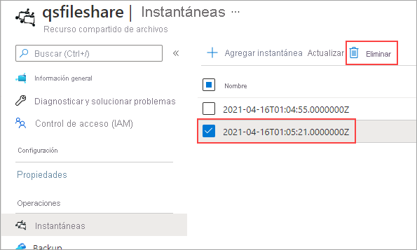

# Inicio rápido: Creación y administración de un recurso compartido de Azure Files con Windows Virtual Machines

El artículo muestra los pasos básicos para crear y usar un recurso compartido de Azure Files. Este inicio rápido se centra en la configuración rápida de un recurso compartido de Azure Files para experimentar el funcionamiento del servicio. Si necesita instrucciones más detalladas para crear y usar recursos compartidos de archivos de Azure en su propio entorno, consulte [Uso de un recurso compartido de archivos de Azure con Windows](storage-how-to-use-files-windows.md).

Si no tiene una suscripción a Azure, cree una [cuenta gratuita](https://azure.microsoft.com/free/?WT.mc_id=A261C142F) antes de empezar.

## Inicio de sesión en Azure

Inicie sesión en [Azure Portal](https://portal.azure.com).

## Preparación del entorno

En este inicio rápido, configurará los elementos siguientes:

- Una cuenta de Azure Storage y un recurso compartido de archivos de Azure
- Una máquina virtual Windows Server 2016 Datacenter

### Crear una cuenta de almacenamiento

Para poder trabajar con un recurso compartido de archivos de Azure, es necesario que cree una cuenta de Azure Storage. Una cuenta de almacenamiento v2 de uso general proporciona acceso a todos los servicios de Azure Storage: Blob, File, Queue y Table. El inicio rápido crea una cuenta de almacenamiento de uso general v2, pero los pasos para crear cualquier otro tipo de cuenta de almacenamiento son similares. Una cuenta de almacenamiento puede contener un número ilimitado de recursos compartidos. Un recurso compartido puede almacenar un número ilimitado de archivos, hasta los límites de capacidad de la cuenta de almacenamiento.

[!INCLUDE [storage-create-account-portal-include](../../../includes/storage-create-account-portal-include.md)]

### Creación de un recurso compartido de archivos de Azure

A continuación creará un recurso compartido de archivos.

1. Cuando se complete la implementación de la cuenta de Azure Storage, seleccione **Ir al recurso**.
1. Seleccione **Recursos compartidos de archivos** en el panel de la cuenta de almacenamiento.

    

1. Seleccione **+ Recurso compartido de archivos**.

    

1. Asigne el nombre *qsfileshare* al nuevo recurso compartido de archivos, escriba "1" como **Cuota**, deje la opción **Transacción optimizada** seleccionada, y seleccione **Crear**. El valor máximo de la cuota es 5 TiB (o 100 TiB si tiene habilitada la opción para grandes recursos compartidos de archivos), pero para este inicio rápido solo se necesita 1 GiB.
1. Cree un nuevo archivo txt denominado *qsTestFile* en la máquina local.
1. Seleccione el nuevo recurso compartido de archivos y en su ubicación, haga clic en **Cargar**.

    

1. Vaya a la ubicación donde creó el archivo .txt > seleccione *qsTestFile.txt* > seleccione **Cargar**.

Ya ha creado una cuenta de Azure Storage y un recurso compartido de archivos con un solo archivo en Azure. Ahora creará la máquina virtual de Azure con Windows Server 2016 Datacenter para representar el servidor local en esta guía de inicio rápido.

### Implementación de una máquina virtual

1. A continuación, expanda el menú del lado izquierdo del portal y elija **Crear un recurso** en la esquina superior izquierda de Azure Portal.
1. En el cuadro de búsqueda que está encima de la lista de recursos de **Azure Marketplace**, busque **Windows Server 2016 Datacenter**.
1. En la pestaña **Conceptos básicos**, en **Detalles del proyecto**, seleccione el grupo de recursos que creó para esta guía de inicio rápido.

   

1. En **Detalles de la instancia**, asigne a la máquina virtual el nombre *qsVM*.
1. Deje la configuración predeterminada en **Región**, **Opciones de disponibilidad**, **Imagen** y **Tamaño**.
1. En **Cuenta de administrador**, agregue un **nombre de usuario** y escriba una **contraseña** para la máquina virtual.
1. En **Reglas de puerto de entrada**, elija **Permitir los puertos seleccionados** y luego seleccione **RDP (3389)** y **HTTP** en la lista desplegable.
1. Seleccione **Revisar + crear**.
1. Seleccione **Crear**. La creación de una máquina virtual nueva tardará varios minutos en completarse.

1. Después de completar la implementación de la máquina virtual, seleccione **Ir al recurso**.

Ya ha creado una nueva máquina virtual y ha conectado un disco de datos. Ahora tiene que conectarse a la máquina virtual.

### Conexión a la máquina virtual

1. Seleccione **Conectar** en la página de propiedades de la máquina virtual.

   

1. En la página **Connect to virtual machine** (Conectarse a una máquina virtual), mantenga las opciones predeterminadas para conectarse por **dirección IP** a través del **número de puerto** *3389* y seleccione **Descargar archivo RDP**.
1. Abra el archivo RDP que descargó y haga clic en **Conectar** cuando se le solicite.
1. En la ventana **Seguridad de Windows**, seleccione **Más opciones** y, después, **Usar otra cuenta**. Escriba el nombre de usuario con el siguiente formato, *localhost\nombre de usuario*, siendo &lt;nombre de usuario&gt; el nombre de usuario administrador de la máquina virtual que creó. Escriba la contraseña que creó para la máquina virtual y, luego seleccione **Aceptar**.

   

1. Puede recibir una advertencia de certificado durante el proceso de inicio de sesión. Seleccione **Sí** o **Continuar** para crear la conexión.

## Asigne el recurso compartido de archivos de Azure a una unidad de Windows

1. En Azure Portal, vaya al recurso compartido de archivos *qsfileshare* y seleccione **Conectar**.
1. Seleccione una letra de unidad y copie el contenido del segundo cuadro y péguelo en el **Bloc de notas**.

   :::image type="content" source="media/storage-how-to-use-files-windows/files-portal-mounting-cmdlet-resize.png" alt-text="Captura de pantalla que muestra el contenido del cuadro que debe copiar y pegar en el Bloc de notas" lightbox="media/storage-how-to-use-files-windows/files-portal-mounting-cmdlet-resize.png":::.

1. En la máquina virtual, abra **PowerShell** y pegue el contenido del **Bloc de notas** y presione Entrar para ejecutar el comando. Debe asignar la unidad.

## Creación de una instantánea de recurso compartido

Ahora que ha asignado la unidad, puede crear una instantánea.

1. En el portal, vaya al recurso compartido de archivos, seleccione **Instantáneas** y, a continuación, seleccione **+ Agregar instantánea**.

   

1. En la máquina virtual, abra *qstestfile.txt* y escriba "este archivo se ha modificado" > Guarde y cierre el archivo.
1. Cree otra instantánea.

## Búsqueda de una instantánea de recurso compartido

1. En el recurso compartido de archivos, seleccione **Instantáneas**.
1. En la hoja **Instantáneas**, seleccione la primera instantánea de la lista.

   

1. Abra esa instantánea y seleccione *qsTestFile.txt*.

## Restauración desde una instantánea

1. En la hoja de instantánea de recurso compartido de archivo, haga clic con el botón derecho en *qsTestFile* y seleccione el botón **Restaurar**.

    :::image type="content" source="media/storage-files-quick-create-use-windows/restore-share-snapshot.png" alt-text="Captura de pantalla de la hoja de instantáneas, qstestfile está seleccionado y el botón Restaurar está resaltado.":::

1. Seleccione **Sobrescribir el archivo original**.

   

1. En la máquina virtual, abra el archivo. Se ha restaurado la versión no modificada.

## Eliminación de una instantánea de recurso compartido

1. En el recurso compartido de archivos, seleccione **Instantáneas**.
1. En la hoja **Instantáneas**, seleccione la primera instantánea de la lista y seleccione **Eliminar**.

   

## Uso de una instantánea de recurso compartido en Windows

Al igual que con las instantáneas VSS en el entorno local, puede ver las instantáneas desde el recurso compartido de archivos de Azure montado en la pestaña Versiones anteriores.

1. Ubique el recurso compartido montado en el Explorador de archivos.

   

1. Seleccione *qsTestFile.txt* > haga clic con el botón derecho y seleccione **Propiedades** en el menú.

   

1. Seleccione **Versiones anteriores** para ver la lista de instantáneas de recursos compartidos de este directorio.

1. Seleccione **Abrir** para abrir el archivo.

   

## Restaurar desde una versión anterior

1. Seleccione **Restaurar**. Esta acción copia el contenido de todo un directorio de forma recursiva en la ubicación original en el momento de la creación de la instantánea del recurso compartido.

   
    
    > [!NOTE]
    > Si el archivo no ha cambiado, no verá una versión anterior de ese archivo, ya que este tiene la misma versión que la instantánea. Esto es coherente con el modo en que funciona en un servidor de archivos de Windows.

## Limpieza de recursos

[!INCLUDE [storage-files-clean-up-portal](../../../includes/storage-files-clean-up-portal.md)]

## Pasos siguientes

> [!div class="nextstepaction"]
> [Uso de un recurso compartido de archivos de Azure con Windows](storage-how-to-use-files-windows.md)
