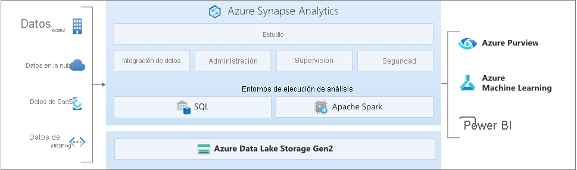

# ¿Qué es Azure Synapse Analytics?

**Azure Synapse** es un servicio de análisis empresarial que acelera el tiempo necesario para obtener información de los sistemas de almacenamientos de datos y de macrodatos. Azure Synapse reúne lo mejor de las tecnologías **SQL** que se usan en el almacenamiento de datos empresariales, las tecnologías de **Spark** que se utilizan para macrodatos, **Pipelines** para la integración de datos y ETL/ELT, y la integración profunda con otros servicios de Azure, como **Power BI**, **CosmosDB** y **Azure Machine Learning**.

## SQL líder del sector

**Synapse SQL** es un sistema de consultas distribuidas para T-SQL que permite escenarios de almacenamiento y virtualización de datos, y que extiende T-SQL para abordar escenarios de streaming y aprendizaje automático.

* Synapse SQL ofrece modelos de recurso **sin servidor** y **dedicados**. Para obtener un rendimiento y un costo predecibles, cree grupos de SQL dedicados para reservar la capacidad de procesamiento de los datos almacenados en tablas SQL. En el caso de cargas de trabajo no planeadas o en ráfagas, utilice el punto de conexión SQL sin servidor siempre disponible.
* Use las funcionalidades integradas de **streaming** para destinar datos de los orígenes de datos en la nube a tablas SQL.
* Integración de IA con SQL mediante el uso de modelos de **aprendizaje automático** para puntuar los datos mediante la [función PREDICT de T-SQL](/sql/t-sql/queries/predict-transact-sql?view=azure-sqldw-latest&preserve-view=true)

## Apache Spark estándar del sector

**Apache Spark para Azure Synapse** se integra profundamente y sin fisuras en Apache Spark, el motor de macrodatos de código abierto más popular que se usa para la preparación de datos, la ingeniería de datos, ETL y el aprendizaje automático.

* Modelos de aprendizaje automático con algoritmos de SparkML e integración de AzureML para Apache Spark 2.4 con compatibilidad integrada con el modelo delta de Linux Foundation.
* Modelo de recursos simplificado que evita tener que preocuparse por la administración de clústeres.
* Inicio rápido de Spark y escalado automático agresivo.
* Compatibilidad integrada de .NET para Spark que le permite volver a usar la experiencia en C# y el código .NET existente en una aplicación de Spark.

## Trabajar con lagos de datos

Azure Synapse elimina las barreras de la tecnología tradicionales entre el uso conjunto de SQL y Spark. Puede combinar y comparar sin problemas en función de sus necesidades y conocimientos.

* Spark o Hive pueden usar sin problemas las tablas definidas en el lago de datos.
* SQL y Spark pueden explorar y analizar directamente los archivos Parquet, CSV, TSV y JSON almacenados en el lago de datos.
* Carga de datos rápida y escalable entre las bases de datos de SQL y de Spark

## Integración de datos integrada

Azure Synapse incluye el mismo motor de integración de datos y experiencias que Azure Data Factory, lo que permite crear canalizaciones de ELT a escala enriquecidas sin tener que salir de Azure Synapse Analytics.

* Ingesta de datos de más de 90 orígenes de datos
* ETL sin código con actividades de flujo de datos
* Orquestación de cuadernos, trabajos de Spark, procedimientos almacenados, scripts de SQL, etc

## Experiencia unificada 

**Synapse Studio** proporciona una manera única para que las empresas creen, mantengan y protejan sus soluciones en una sola experiencia de usuario.

* Realice tareas clave: ingesta, exploración, preparación, orquestación, visualización.
* Supervise los recursos, el uso y los usuarios en SQL y Spark.
* Use el control de acceso basado en rol para simplificar el acceso a los recursos de análisis.
* Escriba código SQL o Spark e intégrelo con procesos de CI/CD empresariales.

## Interacción con la comunidad de Synapse

- [Microsoft Q&A](/answers/topics/azure-synapse-analytics.html): formule preguntas técnicas.
- [Stack Overflow](https://stackoverflow.com/questions/tagged/azure-synapse): formule preguntas sobre desarrollo.

## Pasos siguientes

* [Introducción a Azure Synapse Analytics](get-started.md)
* [Creación de un área de trabajo](quickstart-create-workspace.md)
* [Uso de grupos de SQL sin servidor](quickstart-sql-on-demand.md)
