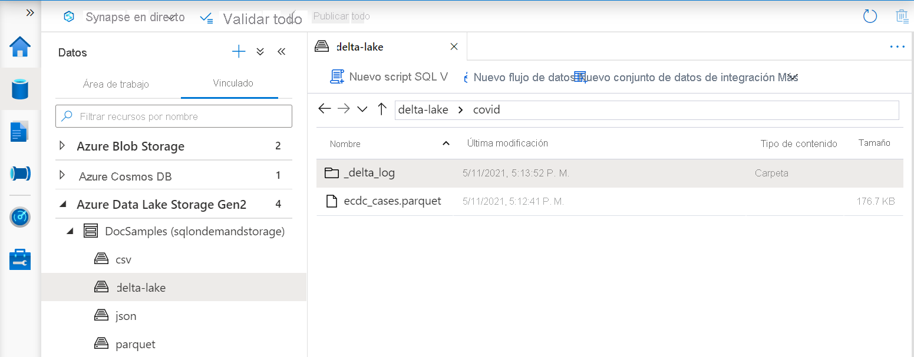
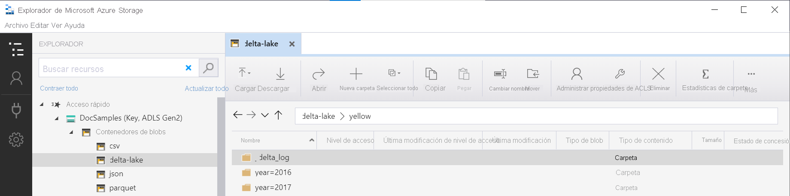

# <a name="create-and-use-views-using-serverless-sql-pool-in-azure-synapse-analytics"></a>Creación y uso de vistas mediante un grupo de SQL sin servidor en Azure Synapse Analytics

En esta sección, aprenderá a crear y usar vistas para encapsular consultas de un grupo de SQL sin servidor. Las vistas le permitirán volver a usar esas consultas. Las vistas también son necesarias si se desea usar herramientas, como Power BI, junto con el grupo de SQL sin servidor.

## <a name="prerequisites"></a>Prerrequisitos

El primer paso es crear la base de datos en que se va a crear la vista e inicializar los objetos necesarios para realizar la autenticación en Azure Storage mediante la ejecución de un [script de instalación](https://github.com/Azure-Samples/Synapse/blob/master/SQL/Samples/LdwSample/SampleDB.sql) en esa base de datos. Todas las consultas de este artículo se ejecutarán en la base de datos de ejemplo.

## <a name="views-over-external-data"></a>Vistas sobre datos externos

Las vistas se crean de la misma manera que las vistas de SQL Server normales. La siguiente consulta crea una vista que lee el archivo *population.csv*.

> [!NOTE]
> Cambie la primera línea de la consulta, es decir, [mydbname], para usar la base de datos que ha creado.

```sql
USE [mydbname];
GO

DROP VIEW IF EXISTS populationView;
GO

CREATE VIEW populationView AS
SELECT * 
FROM OPENROWSET(
        BULK 'csv/population/population.csv',
        DATA_SOURCE = 'SqlOnDemandDemo',
        FORMAT = 'CSV', 
        FIELDTERMINATOR =',', 
        ROWTERMINATOR = '\n'
    )
WITH (
    [country_code] VARCHAR (5) COLLATE Latin1_General_BIN2,
    [country_name] VARCHAR (100) COLLATE Latin1_General_BIN2,
    [year] smallint,
    [population] bigint
) AS [r];
```

La vista usa un elemento `EXTERNAL DATA SOURCE` con una dirección URL raíz del almacenamiento, como `DATA_SOURCE` y agrega una ruta de acceso relativa a los archivos.

### <a name="delta-lake-views"></a>Vistas de Delta Lake

Si va a crear las vistas encima de la carpeta de Delta Lake, debe especificar la ubicación de la carpeta raíz después de la opción `BULK` en lugar de especificar la ruta de acceso del archivo.

> [!div class="mx-imgBorder"]
>

La función `OPENROWSET` que lee datos de la carpeta de Delta Lake examinará la estructura de carpetas e identificará automáticamente las ubicaciones de los archivos.

```sql
create or alter view CovidDeltaLake
as
select *
from openrowset(
           bulk 'covid',
           data_source = 'DeltaLakeStorage',
           format = 'delta'
    ) with (
           date_rep date,
           cases int,
           geo_id varchar(6)
           ) as rows
```

## <a name="partitioned-views"></a>Vistas con particiones

Si tiene un conjunto de archivos con particiones en la estructura jerárquica de carpetas, puede describir el patrón de partición mediante los caracteres comodín en la ruta de acceso del archivo. Use la función `FILEPATH` para exponer partes de la ruta de acceso de carpeta como columnas de partición.

```sql
CREATE VIEW TaxiView
AS SELECT *, nyc.filepath(1) AS [year], nyc.filepath(2) AS [month]
FROM
    OPENROWSET(
        BULK 'parquet/taxi/year=*/month=*/*.parquet',
        DATA_SOURCE = 'sqlondemanddemo',
        FORMAT='PARQUET'
    ) AS nyc
```

Las vistas con particiones realizarán la eliminación de la partición de carpeta si se consulta esta vista con los filtros de las columnas de partición. Esta solución podría mejorar el rendimiento de las consultas.

### <a name="delta-lake-partitioned-views"></a>Vistas con particiones de Delta Lake

Si va a crear las vistas con particiones encima del almacenamiento de Delta Lake, puede especificar solo una carpeta de Delta Lake raíz; no es necesario exponer explícitamente las columnas de partición mediante la función `FILEPATH`:

```sql
CREATE OR ALTER VIEW YellowTaxiView
AS SELECT *
FROM  
    OPENROWSET(
        BULK 'yellow',
        DATA_SOURCE = 'DeltaLakeStorage',
        FORMAT='DELTA'
    ) nyc
```

La función `OPENROWSET` examinará la estructura de la carpeta subyacente de Delta Lake e identificará y expondrá automáticamente las columnas de partición. La eliminación de particiones se realizará automáticamente si coloca la columna de partición en la cláusula `WHERE` de una consulta.

El nombre de la carpeta en la función `OPENROWSET` (`yellow` en este ejemplo) que se concatena con el URI `LOCATION` definido en el origen de datos `DeltaLakeStorage` debe hacer referencia a la carpeta raíz Delta Lake que contiene una subcarpeta denominada `_delta_log`.

> [!div class="mx-imgBorder"]
>

No use la cláusula `WITH` en la función `OPENROWSET` al consultar datos de Delta Lake con particiones. Debido al problema conocido en la versión preliminar, la cláusula `WITH` no devolverá correctamente los valores de las columnas de partición subyacentes. La eliminación de particiones funciona bien si usa directamente la función `OPENROWSET` con la cláusula `WITH` (sin vistas).  

## <a name="use-a-view"></a>Uso de una vista

Puede usar vistas en las consultas de la misma manera que las utiliza en las consultas de SQL Server.

En la consulta siguiente se muestra el uso de la vista de *population_csv* que creamos en la sección [Creación de una vista](#views-over-external-data). Devuelve los nombres de país/región con su población en 2019, en orden descendente.

> [!NOTE]
> Cambie la primera línea de la consulta, es decir, [mydbname], para usar la base de datos que ha creado.

```sql
USE [mydbname];
GO

SELECT
    country_name, population
FROM populationView
WHERE
    [year] = 2019
ORDER BY
    [population] DESC;
```

## <a name="next-steps"></a>Pasos siguientes

Para más información sobre cómo consultar distintos tipos de archivo, vea los artículos [Consulta de archivos .csv](query-single-csv-file.md), [Consulta de archivos Parquet](query-parquet-files.md) y [Consulta de archivos JSON](query-json-files.md).
